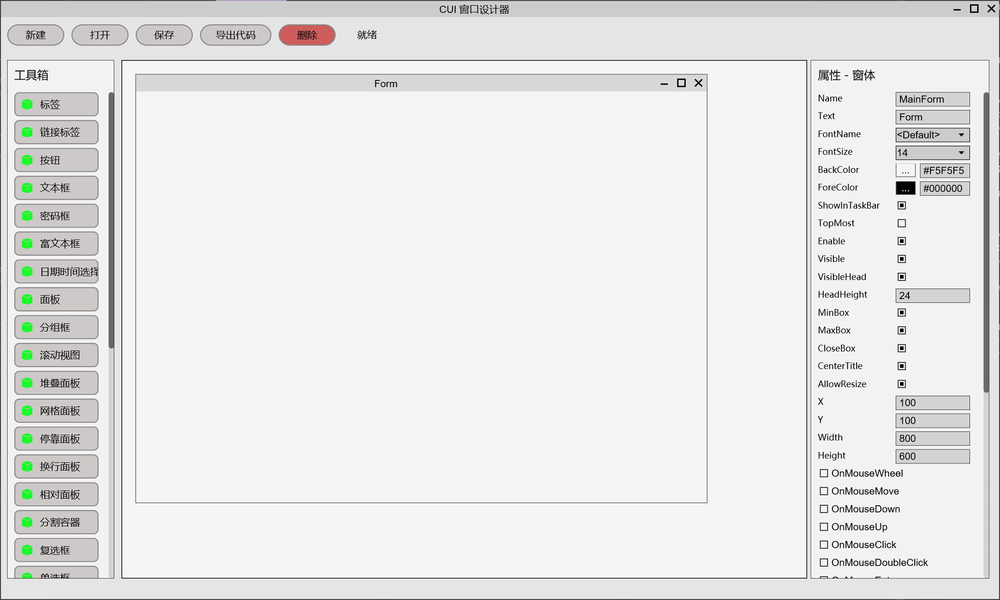
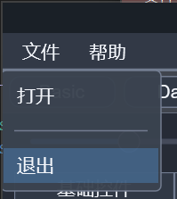
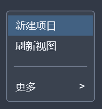
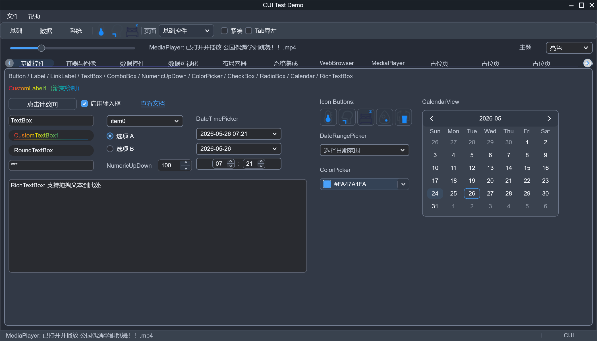
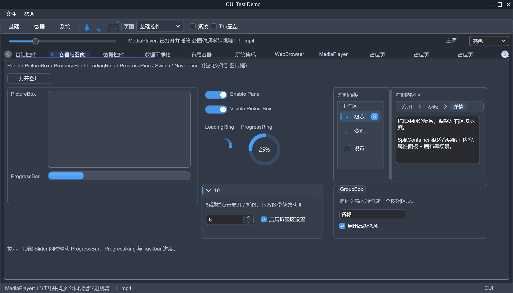
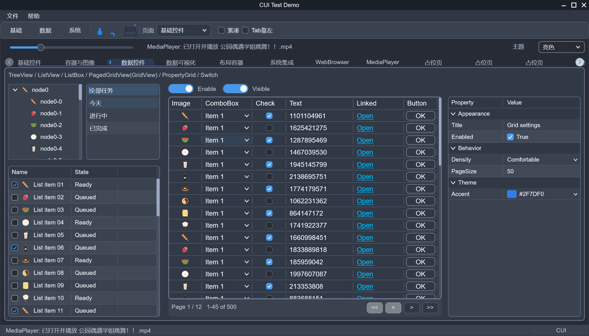
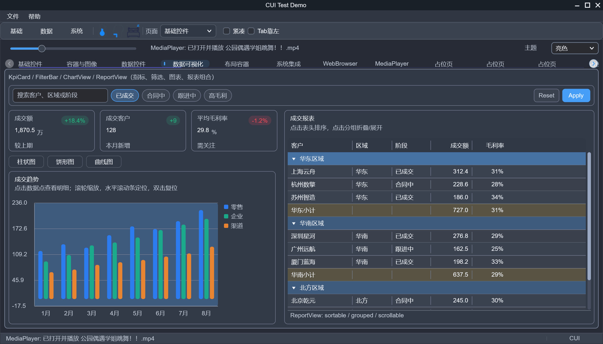
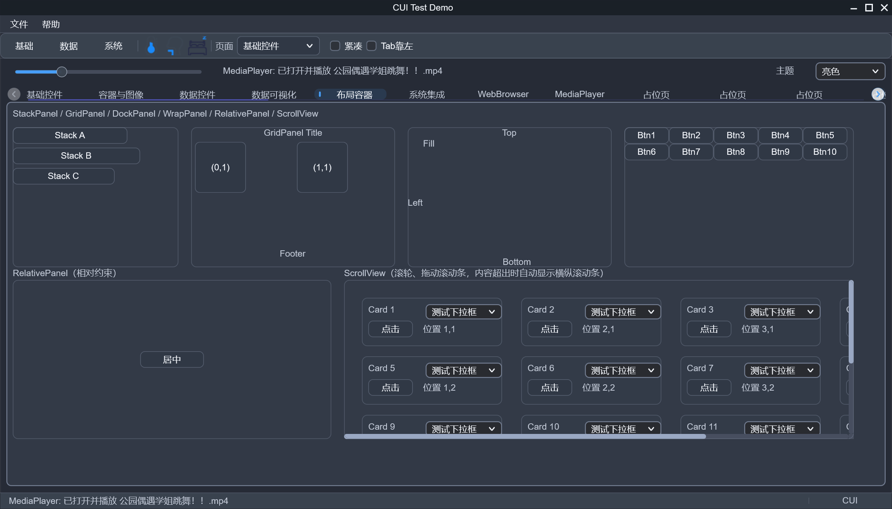
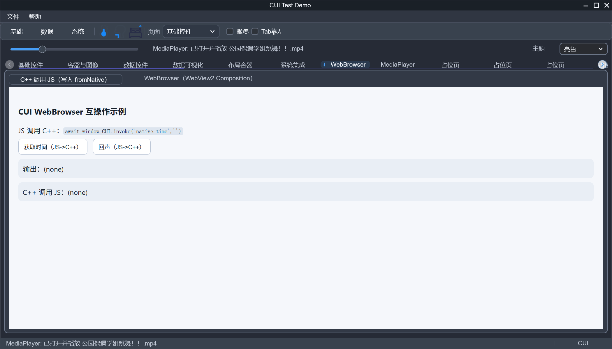
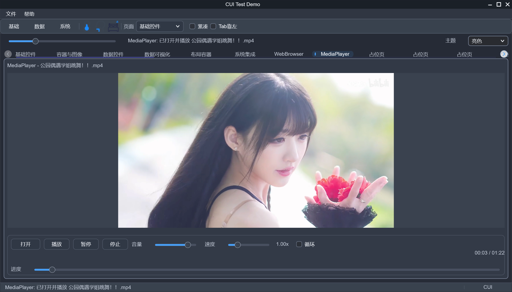

# CUI - Modern Windows GUI Framework

[English](README.en.md) | [简体中文](README.md) | [Full Documentation](ReadMeFull.en.md)

[完整文档(中文)](ReadMeFull.md)

CUI is a modern native Windows GUI framework based on **Direct2D** and **DirectComposition** (C++20). It also comes with a **visual designer** (drag & drop, JSON save/load, and automatic C++ code generation).

This repository mainly contains:
- `CUI/`: runtime GUI framework and controls
- `CuiDesigner/`: visual UI designer
- `CUITest/`: samples and test program
- `D2DGraphics/`: low-level graphics wrapper
- `Utils/`: general utilities still used by the designer and related projects

## Features

- **High-performance rendering**: Direct2D hardware acceleration + DirectComposition compositor
- **Controls**: 33+ commonly used UI controls
- **Layouts**: multiple layout containers (Stack/Grid/Dock/Wrap/Relative, etc.)
- **Events & input**: mouse/keyboard/focus/drag-drop events, with IME support
- **SVG support**: built-in nanosvg (included)
- **Media playback**: built-in MediaPlayer control
- **WebView2 integration**: embed modern web content via Microsoft WebView2
- **Designer workflow**: property editing, live preview, JSON design files, and C++ code generation

## Screenshots

### Designer

The visual designer supports drag-and-drop layout editing, property inspection, and C++ code generation.

### Demo Window and Menus

The sample application includes a main window menu, a standalone context menu, and multiple TabControl demo pages.

| Window Menu | Context Menu |
| --- | --- |
|  |  |

### TabControl Pages

The following screenshots correspond to different pages selected in the TabControl of the demo window:

| Tab 1 | Tab 2 |
| --- | --- |
|  |  |

| Tab 3 | Tab 4 |
| --- | --- |
|  |  |

| Tab 5 | WebBrowser |
| --- | --- |
|  |  |

### Media Page

The MediaPlayer page demonstrates the built-in media playback control.

## Notes

- **Windows only**: relies on Direct2D/DirectWrite/DirectComposition.
- **Windows version**: `CUI` supports Windows 7+. Use the preprocessor macro `CUI_ENABLE_WEBVIEW2` to enable DirectComposition + WebView2 (requires Windows 8+); without it, only Direct2D HWND rendering is used, maintaining Windows 7 compatibility.
- **Project dependencies**:
  - `CUI` depends on `D2DGraphics`
  - `CUITest` now carries the small helper code it previously consumed from `Utils`, so it no longer depends on `Utils`
  - `CuiDesigner` currently depends on `CUI` and `Utils`
- **Third-party dependencies**: WebView2; the graphics and utility source used by this repo is already included locally
- **Designer output**: the designer saves JSON and generates C++ code; it’s recommended to version-control generated code and keep the JSON design files as the long-term UI source.

## Community

- QQ group: 522222570

License: AFL 3.0 (see `LICENSE`).
