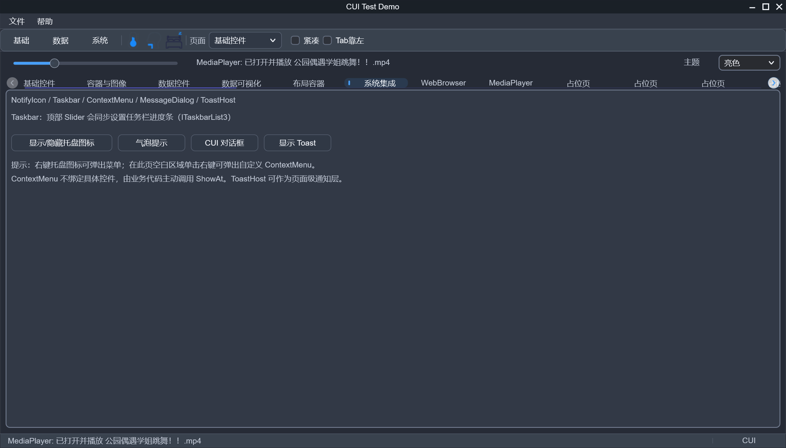

# CUI - 现代化 Windows GUI 框架

[简体中文](README.md) | [English](README.en.md) | [完整文档](ReadMeFull.md)

[完整文档(英文)](ReadMeFull.en.md)

一个基于 **Direct2D** 和 **DirectComposition** 的 Windows 原生 GUI 框架（C++20），并提供配套的 **可视化设计器**（拖放设计 + XML 保存/加载 + 自动生成 C++ 代码）。

本仓库主要包含：
- `CUI/`：运行时 GUI 框架与控件库
- `CuiDesigner/`：可视化 UI 设计器
- `CUITest/`：示例与测试程序
- `D2DGraphics/`：底层图形封装
- `Utils/`：设计器等项目仍在使用的通用工具库

## 特点

- **高性能渲染**：Direct2D 硬件加速 + DirectComposition 合成
- **控件与布局**：提供46+常用控件
- **控件与布局**：提供多种布局容器（如 Stack/Grid/Dock/Wrap/Relative 等）
- **事件与输入**：完善的鼠标/键盘/焦点/拖放事件，支持 IME 中文输入
- **通用数据绑定**：基于控件属性元数据，支持 OneWay、TwoWay、OneWayToSource、OneTime、嵌套属性路径和转换器
- **资源支持**：内置 SVG 渲染（nanosvg 已包含）
- **多媒体功能 集成**：媒体播放器（MediaPlayer）
- **WebView2 集成**：可嵌入现代 Web 内容（基于 Microsoft WebView2）
- **设计器工作流**：拖放编辑属性、实时预览、XML 设计文件保存/加载、自动生成 C++ 代码

## 数据绑定

运行时绑定不依赖硬编码的控件类型或目标属性。控件通过属性元数据声明读、写和变更通知能力，`BindingCollection` 根据绑定模式自动校验：

```cpp
ObservableObject viewModel;
viewModel.SetValue(L"Name", std::wstring(L"CUI"));
textBox->DataBindings.Add(
    L"Text", viewModel, L"Name", BindingMode::TwoWay);
```

这份元数据现在也是控件属性系统的统一契约。`ControlPropertyOptions` 可声明默认值、
Coerce、精确比较器、Changed 回调以及 `AffectsMeasure` / `AffectsArrange` /
`AffectsRender`；需要让公开 setter 从第一次赋值起就表示 Local 值时，可再声明
`TracksLocalValue`。自定义控件的 setter 使用受保护的 `SetPropertyField(...)` 后，直接 C++
赋值、`TrySetPropertyValue(...)` 和 Binding 写入会共享相同的规范化、失效与
`OnPropertyValueChanged` 通知；`ResetPropertyValue(...)` 和
`IsPropertyValueDefault(...)` 则让 Designer 和代码生成器不再硬编码默认值。

属性值按 `Local > Binding > Style > Theme > Default` 取最高优先级。各层通过
`TrySetPropertyValue(name, value, source)` 写入，通过 `ClearPropertyValue(...)` 或
`ClearPropertyValues(source)` 移除；隐藏层仍保留最新值，重新成为最高层时会自动恢复。
Binding 会独占并在清除时释放自己的层；活动 Binding 的层不能由普通属性 API 覆盖或清除，
同一目标属性不允许重复绑定（包括直接构造的 Binding）。交互控件更新当前值时应使用
`SetCurrentPropertyField(...)`，这样 TwoWay Binding 不会被意外替换成 Local 值。

```cpp
button->TrySetPropertyValue(
    L"BackColor", BindingValue(themeColor),
    ControlPropertyValueSource::Theme);
button->ClearPropertyValue(
    L"BackColor", ControlPropertyValueSource::Theme);
```

`ControlStyleSheet` 在这套来源模型之上提供控件级主题和样式。规则可按运行时类型、StyleId、
多个 StyleClass 以及 Hovered/Focused/Pressed/Disabled/Checked 等状态匹配；同一属性按
ID、Class/状态、类型的特异性和规则顺序级联。资源引用与键名匹配不区分大小写，修改规则或
资源后，已附着控件会自动刷新；附着到根控件时会递归应用，之后加入的子控件也会继承。

```cpp
auto theme = std::make_shared<ControlStyleSheet>();
theme->SetResource(L"Accent", BindingValue(accentColor));

ControlStyleSelector hoveredButton;
hoveredButton.Type = UIClass::UI_Button;
hoveredButton.RequiredStates = ControlStyleState::Hovered;
theme->AddRule(hoveredButton, {
    ControlStyleSetter::Resource(L"BackColor", L"Accent")
});

form->SetThemeStyleSheet(theme); // 递归应用 Theme 层
```

`Button`、`TextBox`、`ComboBox` 的常用状态色、边框、圆角和间距已经接入同一套属性元数据，
可直接由 Theme/Style/Binding 设置。Designer 属性面板也可编辑 `StyleId` 和逗号分隔的
`StyleClasses`；两者会随 XML 设计文件往返，并写入生成的 C++ 代码。

未选中控件时，窗体属性面板还提供“编辑文档样式表”入口。结构化编辑器可维护强类型资源、
类型/ID/Class/状态选择器和属性 Setter，修改后立即应用到设计画布；无效资源引用、冲突状态或
不能按属性元数据转换的值会在保存前被拒绝。文档样式表随 XML 往返，代码生成器会输出等价的
`ControlStyleSheet` 初始化与 `SetStyleSheet(...)` 调用。

Setter 属性列表也直接来自所选控件类型的运行时属性元数据，并自动推断 Bool、数值、枚举、
Color、Thickness、Size 或 Length 类型及示例值。即使画布尚未放置该类型，Designer 也会创建
轻量探针检查属性存在性、可写性、类型转换与 Coerce，因此错误不会延迟到以后添加控件时才暴露。

同一目录也会补充普通属性面板中尚未由旧字段覆盖的“元数据属性”。编辑继续走运行时的转换与
Coerce，规范值保存在可选的 `props.metadata` 强类型属性包中；旧 XML 的既有字段保持兼容，加载、
撤销/重做和 C++ 生成则统一使用属性的规范名称和值类型。

`ControlPropertyOptions::Design` 可进一步声明属性是否可浏览、显示名、分类与排序、首选编辑器、
强类型选项、数值范围和持久化策略。普通属性面板按这些描述分组并自动选择 Boolean、Choice、
Color、Thickness、Size、Length 或数值/文本编辑器；`Legacy` 与 `Transient` 属性不会误写入通用
metadata 包，但仍可作为 Binding 或样式 Setter 的目标。

`StackPanel` 的 Orientation、Spacing 与内容对齐，`WrapPanel` 的 Orientation、ItemWidth、
ItemHeight，`DockPanel` 的 LastChildFill，以及 `SplitContainer` 的方向、分隔条尺寸/位置、面板
最小尺寸、固定状态和分隔条外观，均已完全迁移到这条通用路径。拖动分隔条得到的新位置也会回写
同一份元数据。新文档只写 `props.metadata`，属性面板和生成的 C++ 不再维护容器专用分支；旧文档
中的同名 `Extra` 字段仍可读取，并在没有新 metadata 值时自动升级。若两种格式同时存在，以强类型
metadata 为准。

`Slider` 与 `NumericUpDown` 的范围、步长、吸附、输入行为和控件专用外观也使用同一契约。
`Min` 变化会重新 Coerce `Max` 与 `Value`，交互更新 `Value` 时保留现有 Binding，范围导致的值变化
仍会发布统一通知。Designer 按元数据顺序恢复和生成这些依赖属性，避免按属性名排序时先应用
`Value` 而得到不同结果；旧 Extra 继续只读升级。

`GroupBox` 的标题间距、圆角和颜色，以及 `Expander` 的标题几何、展开状态、动画时长和专用外观
也已完全迁移。负数或非有限几何值由运行时元数据统一 Coerce；Expander 的鼠标、键盘与 `Toggle()`
交互使用当前值更新，因此不会用 Local 值覆盖现有 TwoWay Binding。新文档和生成代码只使用
`props.metadata` / `TrySetPropertyValue(...)`，旧 `Extra` 字段仅在缺少同名 metadata 时升级。

`ScrollView` 的内容尺寸、滚动条可见性/粗细、滚轮步长、边框和滚动条颜色也已接入同一契约。
`ContentSize` 以强类型 Size 编辑和持久化，尺寸与粗细由元数据统一钳制为非负值。滚动偏移仍是可观察、
可 Binding 的瞬时运行状态，因此不会写入 `props.metadata` 或生成代码；旧文档中的配置字段会升级为
metadata，旧偏移只在加载时兼容读取。

`Panel` 的边框粗细、圆角与禁用遮罩也已成为所有容器共享的元数据属性。`ToolBar`、`StatusBar`、
`PagedGridView`、`Expander`、`ScrollView` 不再声明同名裸字段，而是共享 Panel 的唯一 backing；需要不同
圆角默认值的派生类型只覆盖自己的元数据默认值。因此通过基类引用、派生类型、Theme/Style/Binding 或
Designer 修改属性时，绘制与属性来源始终看到同一状态。

`ToolBar` 与 `StatusBar` 的专用布局、行为和外观也已完全迁移。原来遮蔽 `Control::Padding(Thickness)` 的
整数 `Padding` 已改名为语义明确的 `HorizontalPadding`；两者现在可同时编辑和生成，不再发生类型歧义。
ToolBar 的自动高度项会跟随 `ItemHeight` 更新，StatusBar 的 `TopMost`、分段间距/圆角、颜色和显示开关
均支持 Theme/Style/Binding。旧 XML 的 `padding`、`gap`、`itemHeight`、`topMost` 只读升级到 metadata，
StatusBar 的 parts 集合仍使用结构化专用持久化。

`Control::Children` 现在是兼容 vector 读取的拥有型 `ObservableCollection`。直接 insert/erase、Replace、
Move、Swap 或批处理都会先同步 Parent/ParentForm、继承样式、Form 交互引用、布局与可访问性，再通知公开
观察者；空指针、重复项、跨父级挂接和成环结构会回滚并拒绝。新代码可使用 `InsertOwned()`、
`DetachControlAt()`、`DeleteControlAt()` 与 `ClearControls()` 明确表达所有权；直接 erase/clear 只分离对象。

`TabControl` 的选中索引、标题位置、动画模式/时长、标题几何、滚动行为和全部专用颜色也已接入
同一套元数据。`TitleWidth`、`TitleHeight` 与标题滚动量现在使用浮点 DIP；鼠标、键盘、拖动和
`SelectPage()` 通过 current-value 更新保留活动 Binding。`TitleScrollOffset` 可观察、可 TwoWay Binding，
但属于 `Transient` 运行状态，不进入普通属性面板或生成代码。页面集合仍使用结构化持久化；旧 XML 的
`selectedIndex`、标题尺寸/位置和动画模式只在缺少同名 metadata 时升级。新增 `InsertPage`、
`DetachPageAt`、`RemovePage` 与 `ClearPages` 等所有权安全入口；插入和重排会让选中状态按页对象身份移动，
并同步 TwoWay `SelectedIndex`、过渡动画和原生子窗口。`Pages` 现直接投影可观察的 Children 集合。

`Menu` 顶层项与 `ContextMenu` 现在提供对称的插入、分离、删除和清空 API；`MenuItem::SubItems` 改为
兼容 vector 读取的 `ObservableCollection`。直接移动/交换或批量修改会发布结构通知，安全 API 使用
`unique_ptr` 明确转移所有权；菜单树变化时会关闭已失效的悬停/展开路径，避免旧索引命中错误项。

`ComboBox` 的 `SelectedIndex`、`ExpandCount`、动画时长、下拉几何和全部专用颜色也已完成迁移。
鼠标、键盘、`SelectItem()`、`SetExpanded()` 与 `ScrollBy()` 使用 current-value 更新，可在交互后继续
保持 TwoWay Binding；`Expand` 与 `ExpandScroll` 可观察、可绑定，但作为 `Transient` 运行状态不进入
设计文件或生成代码。Items 仍使用结构化持久化，并已改为兼容 `std::vector` 的 `ObservableCollection`；
直接 insert/remove/move/swap 会发布精确变更并让选择和虚拟项 ID 跟随逻辑项，批量作用域合并为一次 Reset。
集合晚于 Binding/metadata 到达时仍会重新校正选择与滚动范围。旧 XML 的 `expandCount` / `selectedIndex` 只在缺少同名 metadata 时升级；生成代码
通过合法的 `std::vector<std::wstring>` 一次性设置 Items，不再输出控件专用裸字段。

`ListView` / `ListBox` 的视图、选择模式、表头/复选框、尺寸、滚轮步长和全部专用颜色现在也使用
同一元数据契约。`SelectedIndex`、焦点/悬停索引与 `ScrollYOffset` 是可观察、可 TwoWay Binding 的
`Transient` 交互状态；单选、Ctrl 多选、范围选择和滚动使用 current-value 更新，不会覆盖活动 Binding。
Columns/Items 继续结构化持久化，同时公开可观察集合；直接结构修改会同步选择、焦点、滚动、稳定 UIA ID
与结构通知。`SetItems()` 可一次恢复多选标志；生成代码先应用配置 metadata，再设置
集合。旧 XML 的 List 标量只在缺少同名 metadata 时升级。`FullRowSelect` 和
`HideSelectionWhenLostFocus` 也已落实到实际绘制语义，ListBox 的隐藏表头通过派生元数据保持 false 默认值。

`GridView` 的表头/行高（`0` 表示 Auto）、单元格几何、滚动条尺寸、行为开关和全部专用颜色也已接入
属性元数据。选择、悬停、排序与横纵滚动是可观察、可 TwoWay Binding 的 `Transient` 状态，鼠标、键盘
和公开选择 API 通过 current-value 更新，不覆盖活动 Binding。`FullRowSelect` 默认开启并参与实际绘制。
Rows/Columns 也是可观察集合；直接增删、移动、交换或排序会按稳定 ID 保持所选行列，并让每行 Cell 与
逻辑列一起移动。大量列/行更新可用可嵌套的 `DeferUpdates()` 合并集合通知、滚动校正与重绘；文本编辑提供 `BeginEdit()`、
`SetEditingText()`、`CommitEdit()` 与 `CancelEdit()`，且可在未挂接 Form 时安全使用。Designer 先生成
metadata，再以批量作用域恢复列，并完整保留 ButtonText 与 ComboBoxItems。

`PagedGridView` 的页大小、分页条几何、行为开关和专用颜色也已迁移到属性元数据；`PageIndex` 是
可观察、可 TwoWay Binding 的 `Transient` 交互状态，分页按钮与 PageUp/PageDown 使用 current-value
更新，不会覆盖活动 Binding。`SetRows()` / `SetColumns()` 提供原子集合替换，可嵌套的
`BeginUpdate()` / `EndUpdate()` 与 `DeferUpdates()` 会把多次源数据修改合并为一次当前页刷新。Rows 与
Columns 公开可观察集合；直接增删、移动、交换或批量 Reset 列时，会按稳定列 ID 同步所有页（包括离屏页）
的 Cell，并让公开通知观察到已完成对齐的数据。

`PropertyGridView` 的布局、编辑行为和全部专用颜色现在共享同一元数据契约；选择、悬停和滚动偏移
保持为可绑定但不持久化的运行状态。`SetItems()` 原子关闭旧编辑器并替换结构集合，公开的
`SelectItem()`、`ClearSelection()`、`BeginEdit()`、`SetEditingText()`、`CommitEdit()` 和
`CancelEdit()` 可在无 Form 场景安全使用。Designer 只为 Items 保留结构化通道（包括 Options 与 Tag），
标量统一写入 `props.metadata`；旧 `extra` 标量仍可读取，并且不会覆盖同名新 metadata。Items 现为
可观察集合；直接插入、删除、移动、交换、排序或批量 Reset 会按稳定身份保持选择、活动编辑器、Binding、
类别折叠状态与滚动范围，删除正在编辑的项则安全结束会话。

`MediaPlayer` 的 `AutoPlay`、`Loop`、`Volume`、`PlaybackRate`、硬件解码/NV12 偏好和
`RenderMode` 也已接入统一属性元数据，支持 Theme、Style、Binding、Designer 属性面板与代码生成。
带 Min/Max 的浮点元数据会自动使用范围滑块；旧设计文件中的媒体标量会迁移到 `props.metadata`，
媒体路径仍单独保存，生成代码保证先应用配置再 `Load()`。运行时新增 `TryPlay()`、`TryPause()`、
`TryStop()`、`TrySeek()`、`TogglePlayback()`、`SeekBy()`、`SetProgress()` 和 `Close()`；
`OnStateChanged` 与携带 HRESULT 的 `OnMediaError` 可用于可靠地驱动 UI 和诊断失败。媒体会话与视频帧
异步回调在析构/关闭时同步解绑定，播放位置也使用原子状态跨解码线程发布。

`WebBrowser` 的公开类布局不再依赖 `CUI_ENABLE_WEBVIEW2`：WebView2、COM 和 DirectComposition
类型都隐藏在 PImpl 中，应用、Designer 与测试可使用同一 ABI。`InitialUrl`、`ZoomFactor`、默认上下文
菜单、状态栏和缩放控件开关已接入统一属性元数据，可参与 Theme、Style、Binding、Designer 持久化与
代码生成。运行时可使用 `TryInitialize()` 和分阶段 HRESULT 查询诊断初始化，使用 `TryNavigate()`、
`TrySetHtml()`、`TryReload()`、`TryStop()`、`TryGoBack()`、`TryGoForward()` 获得明确结果；初始化前的
URL/HTML 请求共用最后写入获胜的待处理槽。异步环境、控制器、事件及脚本回调都受生命周期令牌保护。

`NotifyIcon` 的托盘、提示、气泡和递归菜单现已全链路使用 Unicode；窄字符串兼容入口优先按
UTF-8 解码。显示/隐藏、提示与菜单修改均提供 `Try*` 和 HRESULT 诊断，右键菜单自动弹出，支持多个
图标按窗口/消息/ID 分发，并在 Explorer 重启后恢复。菜单只保存值语义数据，临时 HMENU 不再随对象
浅复制。`Taskbar` 则改为每实例 RAII 持有 `ITaskbarList3`，提供可诊断的进度值、Normal、Paused、
Error、Indeterminate 与 Clear 操作，不再存在共享 COM 指针的重复释放风险。

键盘焦点现在使用统一的 `IsTabStop` / `TabIndex` 契约；`Form` 支持循环 Tab/Shift+Tab、访问键、
默认按钮和取消按钮，`Button`、`LinkLabel`、`CheckBox`、`RadioBox` 与 `Switch` 共享可编程
`Invoke()` 语义。可访问名称、说明、帮助、AutomationId、角色、快捷键和焦点外观均为属性元数据，
可进入 Binding、Style、Designer 和代码生成。Form 通过 `WM_GETOBJECT` 暴露生命周期安全的
原生 UI Automation Fragment 树，并为核心控件提供 Invoke、Toggle、Value、RangeValue、
ExpandCollapse、SelectionItem 和 Selection Pattern；兼容的 `IAccessible` 客户区对象及 WinEvent
仍然保留。密码内容不会作为名称或值公开，窗口销毁后已持有的 Provider 会安全失效。
ListView/ListBox 项、ComboBox 项、TreeNode 以及 GridView 列头、行和单元格也作为稳定的虚拟
Fragment 暴露，支持 Selection、Toggle、ExpandCollapse、Grid/Table、Value、Invoke、
VirtualizedItem 与 ScrollItem 等对应 Pattern；逻辑项删除后，已持有的虚拟 Provider 会安全失效。
ListView/ListBox、ComboBox、TreeView 与 GridView 容器同时公开原生 Scroll Pattern，并以当前
视口和可滚动范围报告百分比；不支持滚动的轴按 UIA 约定报告 NoScroll。ListView Details 模式还会
公开稳定的列头、行和单元格层级，以及可按行列寻址的 Grid/Table 与 TableItem 表头关系。
原生 Provider 的首尾、兄弟导航和命中测试现在使用按索引/按 ID 快路径，不再为一次导航复制完整子集合
或递归扫描整棵虚拟树。内置虚拟控件会在结构变化时重建稳定索引；ListView Details 与 GridView 的
单元格 ID 均按访问懒创建，行列删除时仅清理已经物化且失效的身份，因此大数据表格不会预先分配
“行数 × 列数”的 UIA 反向索引。两者可通过 `MaterializedAccessibilityCellCount()` 检查当前物化规模。
ListView 的绘制和图标模式命中测试同时使用 `[start, end)` 可见索引范围；`GetVisibleItemRange()` 可供
延迟图像加载等调用复用，因此逐帧绘制成本只随可见项数增长，而不再扫描完整 Items。
这些控件的虚拟集合现由 `ObservableCollection` 驱动，直接结构修改不再等到下一次 Provider 查询才修正身份。
TreeNode 提供 `AddChild`、`DetachChildAt`、`RemoveChild` 与 `ClearChildren` 来明确表达嵌套节点所有权。

`Form` 会自动响应 Windows 高对比度、客户端动画、文字缩放和键盘焦点提示设置：公共表面、前景色与
焦点色采用系统高对比度色，常用控件动画在系统关闭动画时立即完成，继承或显式设置的字体会按文字比例
缩放。也可用 `Application::QuerySystemVisualPreferences()` 查询快照，并通过
`Form::ApplySystemVisualPreferences(...)` 注入设置以便测试。

`ObservableObject::SetValue` 会自动记录源属性名称、稳定值类型和默认的读写/通知能力。需要只读或静默属性时可显式声明；运行时 Binding 会据这些元数据提前拒绝不兼容模式：

```cpp
auto viewModel = std::make_shared<ObservableObject>();
viewModel->DefineProperty(
    L"Status", std::wstring(L"Ready"),
    true,   // CanRead
    false,  // CanWrite
    true);  // CanObserve
```

`ObservableObject` 也提供字段级和对象级验证状态。派生 ViewModel 可通过受保护的
`SetValidationIssues` / `SetValidationError` 发布信息、警告和错误；Binding 会监听整条
点分路径，并由目标控件的 `DataBindings` 汇总：

```cpp
class ViewModel final : public ObservableObject
{
public:
    void SetName(std::wstring value)
    {
        SetValue(L"Name", value);
        SetValidationError(L"Name",
            value.empty() ? L"Name is required." : L"",
            L"required");
    }
};

auto results = textBox->DataBindings.GetValidationResults();
bool hasErrors = textBox->DataBindings.HasValidationErrors();
```

控件会把这些结果统一呈现为按最高严重级别着色的主题边框，并在悬停时显示最多三条摘要；
可通过 `ShowValidationBorder`、`ShowValidationToolTip`、`ValidationBorderThickness`、
`ValidationCornerRadius` 和 `ValidationToolTipMaxWidth` 调整。`FormThemeFrame` 提供
Info/Warning/Error 及提示浮层配色。`AccessibleDescription` 保存控件本身的说明，
`GetEffectiveAccessibleDescription()` 会把它与当前校验摘要合并，供宿主的可访问性适配层使用。

验证通知使用 RAII 的 `BindingValidationChangedEvent::Subscribe(...)`。嵌套对象被替换时，
Binding 会断开旧验证源并连接新源；数据源先销毁时不会暴露陈旧验证结果。
`DataSourceUpdateMode::OnValidation` 仍表示文本控件失焦时回写，它与源端验证状态是两个
独立概念。

设计器属性面板提供“编辑数据绑定”入口。结构化编辑器会从所选控件的元数据列出目标属性，并根据属性的读、写和变更通知能力过滤 `BindingMode` 与更新策略；源路径支持 `Profile.Name` 这类点分路径。编辑器可选择内置的 `BooleanNegation`、`StringIsNotEmpty`、`StringTrim` 转换器，也可保存应用自定义的 Converter ID。宿主连接设计时数据源后，编辑器还会预览该路径当前的运行时验证问题；这些瞬时问题不会写入设计文件。校验呈现选项和 `AccessibleDescription` 可在普通属性面板编辑，并随设计文件和生成代码保存。绑定随 XML 设计文件保存，生成的窗体在存在绑定时提供 `BindData(IBindingSource& dataContext)`，由应用显式传入数据上下文。

未选中控件时，窗体属性面板提供“编辑 DataContext Schema”入口。Schema 可声明点分源路径的值类型及可读、可写、变更通知能力；定义后，Binding 编辑器会提供源路径下拉选择，并同时校验源能力、目标能力以及 Converter 的源/目标类型。嵌入设计器的宿主还可调用 `Designer::SetDesignDataContext(...)` 连接真实 ViewModel，再在 Schema 编辑器中递归导入运行时元数据；循环对象图会被安全截断。未定义 Schema 的旧工作流仍允许自由输入。当前设计文件格式版本 3 同时保存 Schema 与文档样式表；版本 1、2 文件仍可读取，并在下次保存时自动升级。

自定义 Converter 需要在调用生成窗体的 `BindData` 前注册；元数据让运行时和设计器都能判断目标值类型与反向转换能力：

```cpp
BindingValueConverterRegistry::Register(
    { L"Application.Trim", BindingValueKind::String,
      BindingValueKind::String, true },
    []
    {
        return std::make_shared<MyTrimConverter>();
    });
```

## 界面截图

### 设计器

可视化设计器支持拖放布局、属性编辑和代码生成。


### Demo 窗口与菜单

示例程序包含主窗口菜单、独立上下文菜单，以及 TabControl 的多个演示页面。

| 主窗口菜单 | 上下文菜单 |
| --- | --- |
|  |  |

### TabControl 页面截图

以下截图对应 Demo 中选中 TabControl 不同页面时的显示效果：

| Tab 1 | Tab 2 |
| --- | --- |
|  |  |

| Tab 3 | Tab 4 |
| --- | --- |
|  |  |

| Tab 5 | Tab6 |
| --- | --- |
|  |  |

| WebBrowser |
| --- | --- |
|  |

### 多媒体页面

MediaPlayer 页面演示了框架内置媒体播放控件。


## 注意事项

- **仅支持 Windows**：依赖 Windows 图形栈（Direct2D/DirectWrite/DirectComposition）。
- **Windows版本限制**：`CUI` 支持 Windows 7+。通过预处理器宏 `CUI_ENABLE_WEBVIEW2` 控制是否启用 DirectComposition + WebView2 功能（需要 Windows 8+）；不定义该宏时仅使用 Direct2D HWND 渲染，兼容 Windows 7。
- **项目依赖关系**：
  - `CUI` 依赖 `D2DGraphics`
  - `CUITest` 已内置原先来自 `Utils` 的轻量测试辅助逻辑，不再依赖 `Utils`
  - `CuiDesigner` 当前依赖 `CUI` 和 `Utils`
- **第三方依赖**：WebView2；仓库中的图形/工具源码已直接包含，无需额外引入 `CppUtils/Graphics`
- **设计器输出**：设计器会保存 XML 设计文件并生成 C++ 代码；建议将生成代码纳入版本控制、设计文件作为 UI 源文件长期维护。

## 交流社区
- **QQ群**：522222570

许可证：AFL 3.0，见 `LICENSE`。
