# CUI - 现代化 Windows GUI 框架

[简体中文](README.md) | [English](README.en.md) | [完整文档](ReadMeFull.md)

[完整文档(英文)](ReadMeFull.en.md)

一个基于 **Direct2D** 和 **DirectComposition** 的 Windows 原生 GUI 框架（C++20），并提供配套的 **可视化设计器**（拖放设计 + XAML 保存、验证、预览与动态加载）。

本仓库主要包含：
- `CUI/`：运行时 GUI 框架与控件库
- `CuiDesigner/`：可视化 UI 设计器
- `CUITest/`：基于外部 `DemoWindow.cui.xaml` 的完整动态 UI 控件展厅
- `D2DGraphics/`：底层图形封装
- `Utils/`：设计器等项目仍在使用的通用工具库

## 特点

- **高性能渲染**：Direct2D 硬件加速 + DirectComposition 合成
- **控件与布局**：提供46+常用控件
- **控件与布局**：提供多种布局容器（如 Stack/Grid/Dock/Wrap/Relative 等）
- **事件与输入**：完善的鼠标/键盘/焦点/拖放事件，支持 IME 中文输入
- **通用数据绑定**：基于控件属性元数据，支持 OneWay、TwoWay、OneWayToSource、OneTime、嵌套属性路径和转换器
- **资源支持**：内置 SVG 渲染（nanosvg 已包含）
- **多媒体功能 集成**：媒体播放器（MediaPlayer）
- **WebView2 集成**：可嵌入现代 Web 内容（基于 Microsoft WebView2）
- **设计器工作流**：拖放编辑属性、实时预览、XAML/XML 验证与动态加载；C++ 生成作为可选辅助工具

## 数据绑定

运行时绑定不依赖硬编码的控件类型或目标属性。控件通过属性元数据声明读、写和变更通知能力，`BindingCollection` 根据绑定模式自动校验：

```cpp
ObservableObject viewModel;
viewModel.SetValue(L"Name", std::wstring(L"CUI"));
textBox->DataBindings.Add(
    L"Text", viewModel, L"Name", BindingMode::TwoWay);
```

这份元数据现在也是控件属性系统的统一契约。`ControlPropertyOptions` 可声明默认值、
Coerce、精确比较器、Changed 回调以及 `AffectsMeasure` / `AffectsArrange` /
`AffectsRender`；需要让公开 setter 从第一次赋值起就表示 Local 值时，可再声明
`TracksLocalValue`。自定义控件的 setter 使用受保护的 `SetPropertyField(...)` 后，直接 C++
赋值、`TrySetPropertyValue(...)` 和 Binding 写入会共享相同的规范化、失效与
`OnPropertyValueChanged` 通知；`ResetPropertyValue(...)` 和
`IsPropertyValueDefault(...)` 则让 Designer 和代码生成器不再硬编码默认值。

属性值按 `Animation > VisualState > Local > Binding > Style > Theme > Inherited > Default` 取最高优先级。各层通过
`TrySetPropertyValue(name, value, source)` 写入，通过 `ClearPropertyValue(...)` 或
`ClearPropertyValues(source)` 移除；隐藏层仍保留最新值，重新成为最高层时会自动恢复。
Binding 会独占并在清除时释放自己的层；活动 Binding 的层不能由普通属性 API 覆盖或清除，
同一目标属性不允许重复绑定（包括直接构造的 Binding）。交互控件更新当前值时应使用
`SetCurrentPropertyField(...)`，这样 TwoWay Binding 不会被意外替换成 Local 值。

```cpp
button->TrySetPropertyValue(
    L"BackColor", BindingValue(themeColor),
    ControlPropertyValueSource::Theme);
button->ClearPropertyValue(
    L"BackColor", ControlPropertyValueSource::Theme);
```

`ControlStyleSheet` 在这套来源模型之上提供控件级主题和样式。规则可按运行时类型、StyleId、
多个 StyleClass 以及 Hovered/Focused/Pressed/Disabled/Checked 等状态匹配；同一属性按
ID、Class/状态、类型的特异性和规则顺序级联。资源引用与键名匹配不区分大小写，修改规则或
资源后，已附着控件会自动刷新；附着到根控件时会递归应用，之后加入的子控件也会继承。

```cpp
auto theme = std::make_shared<ControlStyleSheet>();
theme->SetResource(L"Accent", BindingValue(accentColor));

ControlStyleSelector hoveredButton;
hoveredButton.Type = UIClass::UI_Button;
hoveredButton.RequiredStates = ControlStyleState::Hovered;
theme->AddRule(hoveredButton, {
    ControlStyleSetter::Resource(L"BackColor", L"Accent")
});

form->SetThemeStyleSheet(theme); // 递归应用 Theme 层
```

`Button`、`TextBox`、`ComboBox` 的常用状态色、边框、圆角和间距已经接入同一套属性元数据，
可直接由 Theme/Style/Binding 设置。Designer 属性面板也可编辑 `StyleId` 和逗号分隔的
`StyleClasses`；两者会随 XML 设计文件往返，并写入生成的 C++ 代码。

未选中控件时，窗体属性面板还提供“编辑文档样式表”入口。结构化编辑器可维护强类型资源、
类型/ID/Class/状态选择器和属性 Setter，修改后立即应用到设计画布；无效资源引用、冲突状态或
不能按属性元数据转换的值会在保存前被拒绝。文档样式表随 XML 往返，代码生成器会输出等价的
`ControlStyleSheet` 初始化与 `SetStyleSheet(...)` 调用。

Setter 属性列表也直接来自所选控件类型的运行时属性元数据，并自动推断 Bool、数值、枚举、
Color、Thickness、Size 或 Length 类型及示例值。即使画布尚未放置该类型，Designer 也会创建
轻量探针检查属性存在性、可写性、类型转换与 Coerce，因此错误不会延迟到以后添加控件时才暴露。

普通控件属性面板现在直接由包含 Legacy 属性的目录视图生成全部可浏览标量。Text、位置、尺寸、
颜色、Margin/Padding、对齐等常用属性不再另有一份显示分支，编辑时也经过相同的运行时元数据，因此
Coerce、变更回调以及 Local/Style/Binding 优先级不再被设计器直接字段赋值绕过。统一访问层按
`Persistence` 自动维护可选的 `props.metadata` 强类型属性包：Metadata/Automatic 写入规范值，
Legacy/Transient 则主动移除重复项；重置会清除 Local 值并显露下一个 Style、Binding、Theme 或
默认值。旧 XML 的既有字段保持兼容，加载、撤销/重做和 C++ 生成继续使用规范名称和值类型。

`ControlPropertyOptions::Design` 可进一步声明属性是否可浏览、显示名、分类与排序、首选编辑器、
强类型选项、数值范围和持久化策略。普通属性面板按这些描述分组并自动选择 Boolean、Choice、
Color、Thickness、Size、Length 或数值/文本编辑器；`Legacy` 与 `Transient` 属性不会误写入通用
metadata 包，但仍可作为 Binding 或样式 Setter 的目标。

`X` / `Y` / `Enabled` / `Dock` 只是规范属性 `Left` / `Top` / `Enable` / `DockPosition` 的显示名；
Grid 行列和 Dock 只在对应父容器中出现。进度环、日期选择器、PictureBox、TreeView 等原先由控件类型
分支显示的标量也已注册为属性元数据。ComboBox Items、GridView Columns、Tab Pages、ToolBar Buttons、
Tree Nodes、Grid Definitions、Menu Items 与 StatusBar Parts 仍使用结构化对话框，但入口统一来自可扩展的
`DesignerCustomEditorCatalog`，属性面板不再维护控件类型 `if/else` 链。八类对话框在打开前统一建立文档事务；
只有用户确定且后置文档有效时才以一条命令提交，取消和无变化不入栈，异常、嵌套编辑、捕获或入栈失败会
恢复编辑前文档及完整选择。事务返回 `Begun`、`Committed`、`Unchanged`、`RolledBack`、`Canceled`、
`Aborted`、`Rejected` 或 `Failed`，调用方可区分无变化、业务拒绝和基础设施失败；取消时若检测到对话框
泄漏了修改，会自动恢复而不是直接丢弃前置快照。

不属于运行时元数据、但属于控件设计包装器的 Name、Locked、Anchor、StyleId、StyleClasses、字体覆盖和
MediaPlayer 媒体路径，也统一由 `DesignerControlPropertyCatalog` 描述。PropertyGrid 通过 Binder
捕获、应用和恢复这些值，唯一命名、字体继承、Anchor 保持边界和设计期附加数据不再散落在文本、
布尔或浮点编辑分支中；未知属性或类型错误会直接拒绝，不再回退为裸字段赋值。

`DesignerPropertyRowCatalog` 再把窗体目录、包装器专用目录和运行时元数据投影为同一种属性行：统一携带
来源、当前强类型值、分类/顺序、编辑器、Choice、数值范围、Reset 能力，以及 Binding/Validation/Style/
Theme 诊断。控件属性会在投影阶段按名称
去重并全局排序，因此 Common/Layout/Appearance 等分类只生成一次。设计器把这条行流直接投影到 CUI 原生
`PropertyGridView`：Boolean、Enum、Color 和 Slider 使用原生编辑器，颜色选择复用 `ColorPickerPopup`；
混合值、Reset、结构化 Action 行和滑块编辑事务作为通用能力扩展在 `PropertyGridView` 内，不再由设计器逐行
拼装 TextBox/CheckBox/ComboBox/Button。诊断会给出绑定路径、模式、Converter、预览连接状态、源端
校验问题，以及提供候选值的样式规则 ID/特异性和被更高优先级值遮蔽的原因。

画布多选会把完整选择集合交给同一 Binder。属性面板只显示所有所选控件中 kind、编辑器与约束兼容的
公共属性，并明确标记“多个值”与“混合来源”；`Name` 这类对象身份属性不会参与批量编辑。输入或选择新值
会先对全部目标做类型/绑定所有权预检，再一次应用，并把整批修改连同完整选择集写成一条撤销命令。
至少一个目标仍由 Binding 拥有的属性显示为只读，Apply 与 Reset 都不能偷偷写入 Local；不同目标的诊断
不一致时会单独标记，而不会把主选控件的详情冒充整组状态。

属性写入与 Reset 进一步统一到 `DesignerPropertyEdit` 事务服务：服务先验证全部目标，再捕获每个目标的
Local/包装器值与 metadata 跟踪快照；任何 setter 拒绝或抛出异常都会逆序恢复已经触碰的目标，并返回包含
控件名的错误。属性面板顶部保留固定、可访问的错误状态区，成功编辑或切换选择后清除。普通标量
Apply/Reset 与分组滑块直接提交逐属性差量；DataContext Schema、文档样式、Binding 和结构编辑器复用
`DesignerCanvas` 的结果型事务。ComboBox Items（连同 `SelectedIndex` 的 Local/Binding 值来源、Binding
配置和 metadata 跟踪）、TreeView 节点、GridView 列、GridPanel 行列定义及 StatusBar 分段使用
`ControlStructureCommand` 的单控件强类型差量；递归 Menu Items 也保留文本、命令 ID、快捷键、启用状态、
分隔符和层级所有权。TabControl 页面与 ToolBar 按钮使用 `ControlOwnedCollectionCommand`，在缺席状态持有直接子树，
并原样恢复页内/按钮包装器、稳定 ID、选择、尺寸覆盖及 Tab `SelectedIndex` 的 Local/Binding 状态，不再保留完整文档。
PropertyGrid 不再自行复制前后文档/选择捕获、命令构造或失败恢复；
滑块连续编辑在预览失败或提交失败时同样恢复拖动前状态。

`PropertyGrid::ApplyPropertyValue(...)`、`ResetPropertyValue(...)` 和只读的行/错误查询接口把同一条
生产交互路径开放给自动化，而不会绕过 Binder 或命令栈。`Designer.exe --self-test` 可在不创建窗口的
情况下构造真实 `DesignerCanvas` 与 `PropertyGrid`，验证混合值、多选批量修改、拒绝错误、Reset、
完整选择、Undo/Redo 的文档重建、事务状态、取消时泄漏修改恢复、业务拒绝/异常回滚，以及设计期 Binding
连接/断开时 Local 后备值的恢复，作为模型单元测试之外的 Designer 运行时冒烟门禁。

设计器工具箱按“基础控件、输入、布局、数据与列表、状态与反馈、导航与外壳、媒体与 Web”分组，支持中文
名称、C++ 类型名和分类的多关键词筛选。每种控件使用代码原生的矢量轮廓图标，窄侧栏中的长类型名会单行
省略，避免原先所有控件共用一个 SVG 和简单按钮造成的辨识困难。

工具箱条目既可单击后在画布落点，也可直接拖到 Form 或嵌套容器。直接拖动超过系统拖拽阈值后，画布会
高亮实际接收区域并显示控件默认尺寸的半透明预览；普通容器、当前 TabPage 和 SplitContainer 的 First/Second
区域都按最终放置规则解析。松开鼠标只提交一条可撤销的添加命令，`Escape`、捕获丢失或窗口失活会清除预览
并取消操作，不会留下按下状态或修改文档。

工具栏和画布快捷键现在提供复制、剪切、粘贴（`Ctrl+C` / `Ctrl+X` / `Ctrl+V`）。多选时只复制选区中的
顶层根及其完整子树，父子同时选中不会重复；内容以规范、可读的 CUI XAML 写入 Windows Unicode 文本剪贴板，
因此也能在编辑器或不同 Designer 进程之间传递。普通 `Ctrl+V` 会重新分配 stable ID、按大小写不敏感规则生成
唯一名称，同步修正普通父级和 TabPage 引用，并以 12 DIP 级联偏移选中新根；`Ctrl+Shift+V` 执行“原位粘贴”，
保留源片段的局部 X/Y，且不消耗后续普通粘贴的级联序号。画布右键“粘贴到此处”会把多根片段的包围框左上角
精确放到命中的 Canvas/Panel、TabPage 或 SplitContainer First/Second 区域，并保持根之间的相对布局。布局托管
容器则使用自身语义：Stack/Wrap/ToolBar 按点击边界插入并保持多根顺序，Grid 写入命中单元格，Dock 根据边缘/
中心选择停靠方向并避开末项填充，RelativePanel 把点击位置转换为 Margin。普通粘贴会使用当前控件所在容器；
显式选择另一个 Panel/布局容器或 TabControl 后粘贴则进入该容器/当前页。连续粘贴同一个容器会保持上一次目标，
不会把后续副本嵌进前一个副本。绝对布局目标会保留手写 XAML 的 `Canvas.Left` / `Canvas.Top` 坐标表示；进入布局
托管容器时则清理无效的 Canvas 坐标。一次粘贴或剪切只产生一条 Undo 记录；无效目标、插入序号、坐标溢出或
内容不会修改当前文档或历史。

复制或重复时，若事件值仍表示控件的约定默认处理函数（例如 `Button1_OnMouseClick`），副本随控件重命名后会
同步改为 `Button2_OnMouseClick`；子树内显式引用该默认函数的共享事件也会一起更新。用户明确填写的自定义或
外部处理函数名保持原样，因此复制子树既不会意外绑定回原控件，也不会破坏有意共享的业务处理函数。

带 Binding 的控件片段会同时携带实际引用的 DataContext 路径、所有父路径及其类型/读写/通知能力，未使用的
Schema 项不会污染剪贴板。粘贴到另一文档时只补充缺失路径；同名路径始终以目标文档为准。若目标原本使用空
Schema 的宽松模式，其既有绑定路径会先补为 `Unknown`，避免导入第一条显式路径后让原有控件突然失效。
Schema 合并和控件插入属于同一 Designer 命令，Undo/Redo 会同时恢复两者。

带样式的控件片段也会裁剪并携带真正匹配所复制节点的规则，以及这些规则引用的资源。目标文档中相关规则和
资源完全一致时直接复用，不会因同文档重复而不断追加样式；存在同名资源、Class、StyleId 或全局/类型规则
冲突时，Designer 会为每个粘贴节点生成私有 StyleId/限定 Class，重命名资源引用，并保持源规则的状态、级联
优先级和先后顺序。目标原有控件仍使用自己的样式，样式导入与控件插入由同一条 Undo/Redo 命令恢复。

主工具栏与画布右键菜单的三种粘贴命令会随 Windows 剪贴板实时更新可用状态：没有非空文本、只有位图/文件，
或严格文档事务正在进行时自动禁用；跨应用复制出文本后无需重新聚焦或重启 Designer 即可启用。剪贴板源在
发布通知时若仍被短暂占用，Designer 会做有限次延迟重读，避免命令永久停留在旧状态。外部非空文本仍在执行
粘贴时走完整 CUI XAML 解析与事务验证，因此格式错误会得到诊断且不会修改文档。

`Ctrl+D` 可在不覆盖系统剪贴板的情况下创建副本，并为每个源根保留原普通父级、TabPage 或 SplitContainer
区域。绝对布局和 RelativePanel 分别以 Location 和 Margin 偏移 12 DIP；Stack/Wrap/Dock/ToolBar 则把副本
紧邻源项插入，Grid 保留原单元格，避免布局容器忽略 X/Y 后出现重叠或跑到列表末尾。工具栏“排列”弹出菜单提供左/中/右、
上/中/下对齐，水平/垂直等距分布，相同宽度/高度/尺寸，以及上移/下移一层和置顶/置底；对齐和同尺寸以
主选控件为基准，分布保持两端控件不动。几何排列只作用于同一非布局托管父级，Grid、Stack、Dock、Wrap、
Relative 和 ToolBar 仍由自身布局属性决定位置。层级操作同时维护同级顺序与显式 `ZIndex`，快捷键为
`Ctrl+]` / `Ctrl+[`，加 `Shift` 直接置顶/置底。每次重复或排列只产生一条 Undo 记录并保留完整多选。

工具栏现在直接显示可动态禁用的“撤销/重做”，无历史时不可点击；可用时其无障碍说明和画布菜单会显示下一条
命令名称。画布右键会先按命中更新主选控件，点击已选集合成员会保留多选，空白处则切换到 Form 上下文；菜单
集中提供撤销/重做、剪切/复制/粘贴、重复、删除、全部排列命令、当前容器全选和 XAML 编辑。键盘菜单键或
`Shift+F10` 打开同一菜单，`Ctrl+N` / `Ctrl+O` / `Ctrl+S` 分别执行新建、打开和保存。

实时 XAML 编辑器刻意保持为薄壳：它只提供多行文本输入、300ms 防抖验证、有效文档同步、错误定位、
恢复最后有效版本以及确定/取消。XML 语法错误和无效属性、未知控件、重复名称等语义错误都会给出
1-based 行/列与 UTF-16 偏移；“定位错误”或 `F8` 才移动光标，新输入和成功预览会清除旧诊断。
确定把整个编辑会话提交为一条 Designer Undo，取消则恢复打开编辑器前的文档和完整选择。
补全、语法着色、查找替换、格式化、标签配对和多检查点历史不在内置对话框中实现，留给后续
Visual Studio/COM 宿主。
画布下方提供常驻的缩小、缩放百分比、放大和“适配”控件，右键“视图”菜单提供相同命令。`Ctrl+滚轮`
围绕鼠标所在的设计点缩放，`Ctrl++` / `Ctrl+-` 分级缩放，`Ctrl+0` 适合窗口，`Ctrl+1` 恢复 100%；
按住鼠标中键或 `Space+左键` 可平移大画布。缩放范围为 25%–400%，选择手柄和参考线会补偿视图倍率，
缩小时仍保持可见。缩放/平移是纯视图状态，不进入 XML/XAML、不标记文档 Dirty，也不占用 Undo/Redo 历史；
处于“适合窗口”模式时，调整 Designer 窗口或被设计 Form 尺寸会自动重新适配。

底部“网格 N”按钮和画布右键“视图 → 网格与吸附”提供同一组设置：可分别显示网格、吸附到网格、
吸附到参考线，并在 5/10/20 DIP 间切换步长。菜单使用勾选状态反馈当前值，弹出位置会按 DPI 和可用客户区
自动调整。网格与吸附属于 Designer 会话视图状态，切换不会修改设计文档、标记 Dirty 或占用 Undo/Redo。

底部“Tab 顺序”按钮和画布右键“视图 → Tab 顺序模式”提供 WinForms 风格的键盘导航编排。进入后，所有
`IsTabStop=true` 且可接收键盘焦点的控件都会显示与缩放无关的蓝色 `TabIndex` 徽章；依次单击控件会从 0
开始编号，最近一项以绿色标识，`Escape` 退出。隐藏控件仍可通过其设计轮廓参与编排，禁用 Tab stop 的控件
则不会遮挡点击。右键“按布局自动排序”会按画布绝对位置自上而下、从左到右分配连续编号。一次手动编号或
整批自动排序都通过属性元数据提交为可撤销命令；`TabIndex` 会正常进入 XML/XAML 与生成代码，而模式开关和
徽章本身只是 Designer 视图状态。

控件选中后可在属性栏设置 `Locked`，也可从画布右键或“排列”菜单选择“锁定控件”，快捷键为 `Ctrl+L`；
再次执行会解除锁定。锁定控件仍可被选择、修改普通属性、复制、剪切或删除，但不会显示 resize 手柄，并以
橙色锁标记反馈状态。鼠标拖动、分隔条拖动、方向键微调、排列/层级调整都会拒绝包含锁定控件的整组选区，
避免混合选择只移动一部分。锁定/解锁是可撤销的批量属性命令，作为纯设计期 `d:Locked`（或 XML `locked`）
保存，不进入运行时属性或生成代码；复制、粘贴和实时 XAML 往返会保留该状态。

左侧栏可在“工具箱”和“层级”之间切换。层级树以稳定 ID 跟踪 Form、普通容器、TabPage 和所有后代，显示
`Name (Type)`，并为自身 `Visible=false` / `Locked=true` 的控件附加“隐藏”/“锁定”标记；因此被遮挡、尺寸很小或运行时不绘制的控件
仍可直接选中并在属性栏恢复。选择非活动 TabPage 中的后代会先激活完整页签祖先链。画布选择会把主选同步到
层级树并自动展开/滚动到对应节点，选择根节点则回到 Form 属性；Add/Delete/Paste、重命名、Undo/Redo 和
实时 XAML 提交后会重建树，同时按 stable ID 保留用户的展开状态和滚动位置。层级树获得焦点时会继续保留
方向键导航；`Ctrl+C` / `Ctrl+X` / `Ctrl+V` / `Ctrl+D` / `Ctrl+L` / `Ctrl+Z` / `Ctrl+Y` / `Ctrl+A` 和 `Delete`
直接作用于设计选区，无需先把焦点切回画布。

层级树也可直接拖放：落在节点上缘/中部/下缘分别表示插到该节点之前、成为其子项或插到其后，拖到空白处
则移动到 Form 根。拖拽可在同级重排或跨普通容器换父，边缘停留会自动滚动；循环父子关系、TabPage、
Menu/StatusBar 等不合法目标会被拒绝。成功移动保持控件屏幕位置，并作为一条可撤销的结构命令提交。

设计器命令的 `Execute()`、`Undo()` 和 `Redo()` 现在贯穿返回同一结果对象；恢复失败或抛出异常时会保留
错误与 `DocumentRestored` 状态，命令也保留在原撤销/重做栈中。空历史明确返回 `Unchanged`，不再和失败共用
一个 `false`。画布 Add/Delete 使用 `ControlSubtreeCommand`：挂载时由运行时树唯一拥有，缺席时由命令以
`unique_ptr` 拥有分离根，并保存规范化子树节点、父级定位器、同级顺序、ToolBar 尺寸覆盖和完整选择，不再把整份文档存入历史。
增删与移动/缩放的 placement/tree 差量都采用“先成功捕获、再允许修改”的规则；起点冲突会保留原历史项，后置捕获或命令入栈失败会恢复此前状态和选择。键盘微调、鼠标
拖拽、resize 和 SplitContainer 分隔条都使用结果型 Canvas 差量预览事务；分隔条复用单目标
`ControlPropertyCommand`，鼠标抬起只提交一次，Escape、系统取消、
窗口失焦或捕获丢失会恢复预览前状态且不破坏 redo。Canvas 保留最后结果并发布完成事件，Designer 顶部状态区
显示提交、取消或失败原因。Add/Delete/Undo/Redo 另行发布带历史标签的离散命令完成事件；空删除、越界添加、
空历史和真实恢复失败均可区分，工具栏与键盘入口不再无条件报告成功。分隔条预览若无法写入属性元数据会
中止并回滚，不再退回裸 setter。
六类结构差量同样先核对 stable ID、名称、控件类型和 expected 集合状态，再原位恢复目标集合；Undo/Redo
不会替换控件实例，外部修改导致冲突时历史项保留并可在状态修复后重试。命令内存只随目标列/节点/轨道/分段
或 ComboBox/Menu 项增长，不再随文档中的无关控件、样式、Binding 或资源增长。

设计器文档生命周期也使用同一套结果与恢复语义。`CommandManager` 为每次提交分配不可复用的文档状态 ID，
保存点不依赖撤销栈深度，因此“保存后撤销再创建新分支”仍会正确显示 Dirty；撤销/重做到保存点会恢复干净
状态。新建和打开在成功应用完整目标文档后才清空历史并建立新保存点，解析或应用失败会恢复原文档、完整选择
和原 Dirty 状态。保存先在目标目录写入并刷盘临时文件，再原子替换现有设计文件；写入或替换失败不会破坏旧文件，
也不会误清除 Dirty。窗口标题以 `*` 标记未保存修改；新建、打开和关闭前会先结束属性编辑、回滚未提交的画布
预览，并提供保存/放弃/取消提示，当前文件名只在打开或保存真正成功后更新。

Dirty 文档还会在最后一次已提交命令后 750ms 写入自动恢复快照。快照位于
`%LOCALAPPDATA%\CUI\Designer\Recovery`，使用与正式保存相同的临时文件刷盘和原子替换，但不会移动正式
保存点。每个 Designer 进程按 PID 与进程创建时间使用独立会话文件；启动时会跳过仍在运行的其他实例，只提示
恢复真正遗留的最新快照。恢复后的文档没有伪造的 Undo 历史，但保持 Dirty，用户仍需显式保存；成功保存、
新建、打开或干净关闭只清理当前会话快照。损坏、截断、超大或版本不支持的恢复文件会改名隔离，不会覆盖当前
文档，也不会阻止检查其他恢复项。

撤销历史现在同时受 Undo 侧 128 条数量上限和默认 64MiB 估算内存预算约束，预算覆盖 Undo 与 Redo 两侧；超限时优先
淘汰最远历史，但始终保留至少一个最近可操作命令，即使单条大型快照本身超过预算。普通控件属性（包括多选、
Reset、Name、分组滑块和 SplitterDistance 连续预览）使用逐目标属性差量；键盘微调、鼠标移动、缩放、Reparent
与 Stack/Wrap 重排使用 placement/tree 差量，保存 Location/Margin/显式尺寸/对齐/Anchor、Grid/Dock 字段、父级定位器和同级索引。
这些高频编辑不再保存两份完整文档，也不会在普通 Undo/Redo 时重建控件实例。Legacy 属性差量会恢复为序列化
等价的基值，Metadata 属性精确保留 Local 与跟踪状态；八类模态结构编辑均使用局部差量，单个 Form/控件事件及
文档级处理函数重命名使用稳定 ID 事件差量，只有其余窗体属性和 Binding 仍由完整文档事务兜底，
无法标识父级的自定义容器手势也会安全回退完整事务。

相同选择上的同一属性修改以及连续键盘微调，在每次提交间隔不超过 1 秒时会把旧 before 与最新 after 合并为
一条命令。合并不会跨越精确保存点、已有 Redo 分支、选择变化、不同操作标签或不连续的当前状态；目标在其他
快照命令重建控件后会按名称和类型重新解析。Splitter 等鼠标手势显式关闭时间窗合并，每次手势保持独立命令。
Canvas 提供历史预算、当前估算用量和 Undo/Redo 数量查询，也允许
宿主按文档规模调整预算。

属性面板顶部提供“属性 / 事件”双视图（`Ctrl+1` / `Ctrl+2`）和即时筛选框。两个视图不再混排：
属性页只承载属性、Binding 与结构化编辑入口，事件页只承载命名事件和文档级处理函数管理；两页分别保存
筛选词、分类折叠状态和滚动位置，编辑或切换选择不会把用户带回顶部或重新展开全部组。空格分隔的多个
关键词采用 AND 匹配，可搜索属性名、分类、当前值、
编辑器类型、Choice 选项、中英文值来源和诊断详情。属性行会显示当前有效来源 `[默认]`、`[主题]`、
`[样式]`、`[绑定]` 或 `[本地]`，并附带绑定配置、警告/错误和诊断不一致标记；可访问说明与行下摘要会在
Binding 校验或样式表变化后刷新，便于判断 Binding/Style 优先级为何遮蔽修改。
事件行不再是 Boolean 开关，而是可编辑的 C++
成员函数名：空值解绑，旧文档中的 `1/true` 会显示为约定默认名，F4/下拉按钮会同时列出当前文档和用户
`.h/.cpp` 中参数签名兼容的处理函数；源码候选必须是当前 `x:Class` 的唯一真实成员定义，构造函数、错误签名、
重复定义及注释/string/raw string 中的伪代码不会进入列表。事件按操作、值变化、鼠标、键盘、焦点、拖放、
布局、生命周期、数据、导航、媒体和诊断
分类展示，每种控件由事件目录声明一个默认事件。多选控件时，事件页显示所有目标上名称和参数签名均兼容的
公共事件；不同处理函数显示为混合值，直接输入、下拉选择、双击激活或行首重置都会作为一条原子命令应用到
全部目标，任一控件不支持该事件或出现跨签名同名冲突时整批不修改。混合文本进入编辑状态时从空值开始，
不会把 `<多个值>` 占位符写进真实函数名。只要当前筛选中存在可见事件，事件页就会提供“生成/定位处理函数”操作行，
并用 `F12 · 事件名` 提示当前目标；目标优先使用最后选中的可见事件，否则回退到默认事件或首个可见事件。双击事件行、按 `F12`、
点击该操作行或直接双击画布中的控件都会复用同一激活链路：复用现有函数，或通过正常可撤销事务写入约定默认名；双击窗体客户区对应
首次显示事件 `OnShown`。完成过一次代码导出后，再次激活还会
安全重生成 `.g.*`、向用户 `.cpp` 追加缺失桩并打开实际定义所在的 `.h` 或 `.cpp`。源码定位会跳过注释、字符串、原始字符串和
仅有声明的伪匹配；默认探测 VS Code / Visual Studio 并精确跳到定义行，启动参数不经过 shell。
也可用 `CUI_CODE_EDITOR` 指定编辑器，并用包含 `{file}`、`{line}`、`{column}` 的
`CUI_CODE_EDITOR_ARGS` 定义参数模板；编辑器启动失败时才回退系统文件关联。状态栏会明确显示是否完成
精确定位或发生回退。导出成功后，
设计文档用独立于 `Form.Name` 的 `x:Class` 保存 C++ 类身份，并用 `d:CodeBehind` 保存相对设计文件、无扩展名的
代码基路径；保存并重开文档后仍能继续这一体验。首次未导出时只提示建立导出目标，不会从窗体名猜路径覆盖
文件。`x:Class` 支持 `Acme.Views.MainWindow` 或 `Acme::Views::MainWindow`，统一规范为 C++ `::`；生成头会在
对应命名空间声明叶类，文件基名不必等于限定类名。函数名和类名各段在写入前校验为合法 C++ 标识符，同名
不同签名会被拒绝。

代码导出采用生成基类与用户类分离的持久化契约。`FormName.g.h/.g.cpp` 完全由 Designer 管理并可重复
覆盖，包含强类型 `protected` 控件引用、虚事件钩子和由 `EventConnection` 持有的
`Subscribe(std::bind_front(...))`；`FormName.h/.cpp` 仅首次创建，后续新增事件缺少实现时只向用户源文件追加一个
空处理函数体。用户也可把 `void Handler(...) {}` 直接内联到精确用户类体中；此时
`FormName.handlers.g.inc` 会省略冲突的同类声明。当前仍绑定且在用户 `.cpp` 定义的处理函数会声明为
`override`，让生成虚函数契约在编译期可见；解绑后声明自动降级为普通成员并继续保留，使既有用户定义仍能
编译，重新绑定时再恢复 `override`。生成器用共享的轻量
C++ token 索引联合确认用户 `.h/.cpp` 中真实的类内或类外定义，会跳过注释、
普通/原始字符串并区分 `Handle` 与 `HandleSave`，避免伪文本阻止缺失桩生成；扫描还会按参数类型核对已有
同名定义，并要求它确实是可覆盖生成虚函数的非静态、非 cv/ref `void` 成员。参数名或空白可自由调整；返回
类型、`static`/`const`/ref 限定或参数类型漂移会在任何文件替换前明确拒绝，也不会进入 F4 候选或函数体迁移。
类内 `noexcept` 与等价的尾置 `auto ... -> void` 仍可识别。预处理指令及续行宏不参与
作用域分析，确定的 `#if 0` / `#if 1` 失活分支会被忽略；未知宏条件则保守保留，且屏蔽过程不改变源码偏移
或行号，因此生成诊断、跳转和函数体迁移使用同一位置。全限定定义、传统嵌套
`namespace` 和 C++17 `namespace Acme::Views` 中的短类名定义会解析为同一 `x:Class`，错误的相邻命名空间
不会被误认。用户构造函数体是初始化代码的
稳定扩展点；导出前还会用同一预处理/namespace 安全索引确认已有用户头在精确 `x:Class` 作用域中只有一个
类体且继承当前生成基类，并联合检查用户头与源文件恰有一个可用的默认构造函数，防止手改 `x:Class` 后混用
两代类身份。构造函数既可在 `.cpp` 中定义，也可在类体内联或写成 `= default`；`= delete` 和跨文件重复定义会
在写入前阻塞。若用户源文件丢失而头中已有内联/defaulted 构造函数，重建源文件时不会再生成重复构造体。类声明可保留
导出宏、`final`、访问说明和多基类；确定失活分支或相邻 namespace 中的同名类不再构成身份。遇到没有
Designer 标记或类身份不匹配的同名文件时导出会拒绝覆盖。一次导出的全部目标会先写入并 flush 各自
目录内的临时文件，随后按批次提交；任一目标被锁定或替换失败时，已提交的既有文件从备份逆序恢复，原先不
存在的目标被移除，避免 `.g.h/.g.cpp/.handlers.g.inc/.cpp` 落在不同代际。计划还保存读取前五个目标的存在性
与逐字节内容，并在预写入、每个目标提交前及备份创建后复核；IDE 或其他进程在计划建立后修改/新建任一文件
时，整批提交会以并发冲突中止，不会用旧计划覆盖外部修改。交互导出还使用
`GenerateAndCommit` 跨越文件与文档事务：生成成功但 code-behind 关联提交失败时，五文件会按导出前的存在性
和逐字节内容恢复；恢复本身也使用带当前生成结果前置条件的可回滚写入/删除批次，因此回调期间出现的新外部
修改会被保留并明确报告“恢复不完整”，而不会被旧快照二次覆盖。显式事件函数体迁移和 Undo/Redo 使用相同
的条件提交、条件回滚规则。
显式导出是创建或改变 code-behind 关联的唯一入口。选择输出位置后，Designer 会显示当前 `x:Class`、目标
基路径和最终 `d:CodeBehind`，并允许输入限定 C++ 类名；默认保留已有类身份，只有用户在该确认步骤明确修改
类名才执行迁移。迁移不会猜测性改写旧用户函数体，目标仍属于旧类时五文件保护会拒绝覆盖。若设计文档尚未
保存，先记录类身份，首次保存时再根据实际设计文件目录计算可移植相对路径。完整类名、无扩展名输出和相对
路径会在生成五文件前预检。该关联进入正常文档事务和 Undo/Redo，绝对路径不会写入 XML/XAML。没有子控件的
窗体也可导出，因此只包含 `OnShown`、`OnClose` 等 Form 事件的窗口仍能生成用户处理函数。建立关联后，工具栏
“重新生成”会直接复用当前目标，不再重复打开文件和类名对话框；打开、恢复及 code-behind Undo/Redo 会同步
更新该入口的启用状态。按钮还显示生成新鲜度：`*` 表示当前设计与代码不同，`!` 表示文件缺失，
“生成受阻”表示现有用户文件身份或事件签名不允许安全更新；无标记表示五文件计划与磁盘逐字节一致。
Designer 在文档提交后立即标记过期并防抖复核，Undo 回到已生成状态可立即恢复；重新激活窗口时还会检查外部
文件修改。

设计器窗口和构建工具现在共同调用无 HWND 依赖的
`DesignCodeGenerationService`，因此交互导出、CI 与本机构建不会形成两套生成规则。
生成器先通过 `BuildFilePlan` 构造精确的五文件结果，再由原子批次提交；`InspectFreshness` 只复用该计划做
逐字节比较，不创建目录、不更新时间戳。用户 `.h/.cpp` 的任意合法扩展会原样进入计划而不被误报，当前事件
缺少用户桩、`.g.*` 手工漂移、声明文件漂移或任一目标缺失则会被准确识别。
`CuiCodeGenCore/CuiCodeGenCore.vcxproj` 是 `CodeGenerator.cpp`、共享 `CppUserCodeIndex.cpp` 与该服务实现的唯一编译所有者，输出
`CuiCodeGenCore.lib`；Designer、`CuiCodeGen.exe` 和 `CUICoreTests` 只链接这一个库，不再各自编译同一实现。
`CuiCodeGen.exe` 可直接消费 `.xml` / `.xaml`；默认从设计文件读取 `x:Class` 和
`d:CodeBehind`，也可显式覆盖类名和无扩展名输出基路径：

```powershell
.\CuiCodeGen\x64\Debug\CuiCodeGen.exe generate `
    .\CuiStaticGeneratedSample\NamespacedWindow.cui.xaml
.\CuiCodeGen\x64\Debug\CuiCodeGen.exe generate .\MainWindow.cui.xaml `
    --output .\Generated\MainWindow --class Acme.Views.MainWindow --quiet
```

成功、生成失败和命令行用法错误的退出码分别为 `0`、`1`、`2`。命令仍使用同一五文件事务提交和用户代码
保护规则。`build/CuiCodeGen.targets` 提供编译前增量集成；项目引用 `CuiCodeGen.vcxproj`、设置
`CuiCodeGenExe`，声明一个或多个 `CuiDesign` 后，在 `Microsoft.Cpp.targets` 之后导入即可：

```xml
<ItemGroup>
  <CuiDesign Include="MainWindow.cui.xaml">
    <OutputBase>$(ProjectDir)Generated\MainWindow</OutputBase>
    <!-- ClassName 通常省略，以 x:Class 为准 -->
  </CuiDesign>
</ItemGroup>
<Import Project="..\build\CuiCodeGen.targets" />
```

目标用 `$(IntDir)\CuiCodeGen` 下带生成契约版本的 stamp 记录设计文件、targets 规则及全部五个代码文件的
新鲜度，并在 stamp 有效前检查它们都存在；用户 `.h/.cpp` 的合法扩展会保留，`.g.h/.g.cpp/.handlers.g.inc`
被外部修改后普通 Build 会重新生成规范内容。这些输入未变化时不会启动生成器。当前生成契约为 7；
生成输出语义升级会同步提升契约版本，使旧
stamp 路径天然失效；普通的可执行文件重链接不会造成无意义生成。
即使输入时间戳变化，只要规范生成结果逐字节相同，批次提交也会保留代码文件
及其时间戳，从而避免无意义的 C++ 重编译。`CuiStaticGeneratedSample` 已使用这条构建链，而非依赖手工预生成步骤。

后续运行时表示采用“静态生成优先、动态加载复用同一模型”的混合路线，而不是维护两套属性和容器规则。
`DesignDocumentGraph` 已成为文档 ID、父级解析和子级顺序的唯一拓扑层；
`DesignDocumentControlPool` 通过可注入工厂创建控件，在挂载前保持 `unique_ptr` 所有权，失败即自动回滚，
成功后再逐项转移给运行时控件树。公开的 `RuntimeDocumentLoader` 现在可从 `DesignDocument`、规范 XML、
XAML 风格字符串或文件事务性构建完整控件树；失败不会替换调用方已有的 `RuntimeDocument`。运行时文档在
`ReleaseRootControls()` / `TransferRootControlsTo()` 前持有所有根控件，可按稳定 ID 或设计期名称索引控件，并能连接 DataContext、
恢复被 Binding 暂存的 Local 后备值，以及通过应用提供的名称解析器持有控件/窗体事件的 RAII 连接。
`ApplyFormProperties(...)` 会把窗体模型应用到宿主拥有的 `Form`，并记住该目标；`BindFormEvents(...)`
同样保留窗体和名称解析器，使后续原位、重组及完整替换都能自动刷新显示属性并重建窗体事件连接。代码生成输入也已经改为从同一个
`RuntimeDocument` 投影；文档样式在静态代码中挂到每棵根控件树，不再错误调用不存在的
`Form::SetStyleSheet`。

同一份 `.g.h` 还会为每个具备稳定 `DesignId` 的命名控件生成 `ClassReferences<TDocument>` 动态引用视图。
它是零所有权模板，不会让只使用静态 UI 的项目平白依赖 `CuiRuntime`；动态宿主传入 `RuntimeDocument` 或
`session.Document()` 后即可用与静态类一致的 `GetXxx()` 获得当前强类型实例，或用 `ReferenceXxx()` 保存一个
每次访问都按稳定 ID 重新解析、可跟随 InPlace/Recomposed/Replaced 热重载的引用。视图内部保存
`document.Reference()` 返回的弱生命周期视图，而不是裸文档指针；移动文档后仍会跟随，文档销毁后
`operator bool` 为 false，`TryDocument()` / `GetXxx()` 返回空：

```cpp
Acme::Views::MainWindowReferences<DesignerModel::RuntimeDocument>
    ui{session.Document()};
auto namespaceButton = ui.ReferenceNamespaceButton();
if (namespaceButton) namespaceButton->Text = L"Save";
```

`GetXxx()` 返回的裸指针只代表当前实例，不应跨下一次可能替换拓扑的 Reload 长期保存；需要长期持有时使用
`ReferenceXxx()`。`Document()` 保留兼容引用入口并要求视图仍有效，不确定生命周期时使用 `TryDocument()`。
这样静态构造、动态 XAML 与热重载共用一套名称、类型和稳定身份，不再手写 ID 查找或转换。

存在命名事件时，生成头还会产生 `ClassEventSink`。它把文档中的每个唯一处理函数声明为纯虚函数，并提供
`RegisterDynamicEventHandlers(registry)`：一次生成并注册普通控件、Form 和受限自定义事件的全部路由，成员
回调由 `std::bind_front` 绑定到 Sink 实例。动态控制器只需继承 Sink 并实现这些函数（override 可以是 private）；
签名遗漏或类型漂移会在 C++ 编译期失败。注册表使用 `RegisterScopedBatch` 保存完整路由快照并返回移动租约，
任何重复、签名冲突或异常都会恢复到调用前状态，不会给后续 Load 留下半套 resolver；Sink 自动持有租约，
切换到另一注册表、显式 `UnregisterDynamicEventHandlers()` 或析构时只移除本次生成的路由。已经加载的
RuntimeDocument 仍拥有自身 `EventConnection`，所以生成回调还带有弱生命周期门：租约释放后这些旧订阅安全
变为 no-op，不会再调用已经析构的控制器。生成的静态 Form 同样继承该 Sink，因此原有用户处理函数和静态
事件订阅保持同一虚函数契约。Sink 不可复制/移动，事件注册与解绑仍遵循注册表的 UI 线程约束。

```cpp
class MainWindowController final : public Acme::Views::MainWindowEventSink {
private:
    void HandleSave(Control*, MouseEventArgs) override { /* ... */ }
    // 编译器会要求实现 XAML 当前引用的其余处理函数。
};

MainWindowController controller;
DesignerModel::RuntimeEventHandlerRegistry handlers;
if (!controller.RegisterDynamicEventHandlers(handlers, &error)) {
    // 整批失败且注册表保持调用前状态。
}
options.ControlEventResolver = handlers.ControlResolver();
auto formResolver = handlers.FormResolver();
// controller.UnregisterDynamicEventHandlers(); // 可选；析构也会自动释放
```

`DesignDocumentEventIndex` 会把窗体和所有控件的事件引用解析为“函数名 + 精确 C++ Event 函数类型”，统一拒绝
未知事件、非法标识符和跨签名重名。属性栏继续提供每个事件的可编辑函数名与同签名候选，并新增文档级
“重命名处理函数”入口：一次更新所有同名引用、支持合并到同签名函数，并以 `EventHandlerCommand` 批量差量参与
Undo/Redo。命令先核对每个 Form/稳定控件 ID 的原始映射，再离线构造目标事件表并一次提交；过期起点、重复目标
或签名冲突不会覆盖当前文档，普通事件编辑和批量重命名也不会重建控件实例。
建立 code-behind 后，事件行会直接显示 `[检查中]`、`[已实现]`、`[待生成]`、`[源文件缺失]`、`[签名错误]`
或 `[重复定义]`。检查使用与生成提交完全相同的 token/参数类型索引，忽略注释、普通/raw 字符串和参数名差异；
窗口重新激活、文档提交和生成完成都会刷新状态，同时保留事件组展开与滚动位置。双击已实现且整体代码当前的
函数会直接定位而不做无意义生成；缺失定义仍会先安全补齐；签名错误或重复定义不会再卡在生成失败消息上，
而是直接打开现有错误定义供修复。同名重载存在时，导航按当前事件的精确参数类型选择兼容定义。
XML、XAML、动态加载与静态代码生成都会消费同一契约；静态输出仍使用
`Subscribe(std::bind_front(&GeneratedClass::Handler, this))`。重命名默认不会猜测性改写用户 C++ 函数体，
下一次生成会保留旧用户代码并为新名称创建缺失的安全桩；若旧函数在用户 `.cpp` 中恰有一个兼容定义且目标
不存在同签名定义，对话框可显式勾选“同时迁移用户函数体并重新生成代码”。该模式只替换成员定义的函数名
token，函数体、注释和字符串逐字节保留；五文件与文档事件映射作为同一命令提交，Undo/Redo 会反向迁移并
重新生成。源码外部变化、目标冲突或生成失败会保留历史项供重试，并恢复操作前的文档和五文件快照。

动态宿主不再需要为每次加载手写处理函数名 `if/switch`。`RuntimeEventHandlerRegistry` 把函数名、Designer
事件描述、真实 CUI `Event` 成员和可调用对象注册为一条路由。事件目录现在直接由真实成员生成字段名、函数类型
和 C++ 参数类型文本，参数名仅作为生成代码的可读标签；注册时还会比较精确成员身份，因此不能把
`OnMouseMove` 冒充成同签名的 `OnMouseClick`。普通 `Event<>`、校验通知事件以及 Form 继承的 Control 事件使用
同一契约。注册表统一拒绝非法名称、同名异类型和重复路由。`ControlResolver()` / `FormResolver()` 捕获共享注册状态，宿主可在
后续热重载出现新函数名前追加注册，现有 RuntimeDocument 保存的 resolver 会立即看到新路由。静态生成路径
仍直接输出 `std::bind_front`，不会为此引入运行时字符串分派。手工注册可继续使用永久的 `RegisterBatch`；
需要可撤销所有权时使用 `RegisterScopedBatch`，其移动租约只删除本批新增路由，不会替换 resolver 所捕获的
共享 State，也不会断开 RuntimeDocument 已经拥有的 EventConnection。

常规的“文件 + Form + 命名事件 + 保存热重载”宿主优先使用 `RuntimeDocumentSession`。它把文档、共享事件注册表
和无线程 watcher 收口到一个不可移动的 UI 线程会话中，但不会隐藏事务边界或创建后台线程：首次 `MountFile()`
只有在解析、材质化、Binding、控件/Form 事件、显示属性和根提交全部成功后才生效，后续仍由宿主定时调用
`Poll()` 并处理明确的 `Reloaded` / `Failed` 结果。`Form` 和处理函数捕获的业务对象必须比 session 活得更久。

```cpp
Form form; // 先声明：Form 必须比 session 活得更久
DesignerModel::RuntimeDocumentSession session{
    std::chrono::milliseconds{150}};
session.EventHandlers().RegisterControl(
    L"HandleSave", UIClass::UI_Base, L"OnMouseClick",
    &Control::OnMouseClick,
    std::bind_front(&MainWindow::HandleSave, this), &error);
session.EventHandlers().RegisterForm(
    L"HandleCommand", L"OnCommand", &Form::OnCommand,
    std::bind_front(&MainWindow::HandleCommand, this), &error);

DesignerModel::RuntimeDocumentSessionMountOptions mount;
mount.DataContext = viewModel;
if (!session.MountFile(L"MainForm.cui.xaml", form, mount, &error)) {
    // form 与 session.Document() 都保持挂载前状态，可补注册后重试
}

// 在同一个 UI 线程的定时器中调用。
const auto result = session.Poll();
if (result.State == DesignerModel::RuntimeDocumentWatchState::Failed)
    ShowReloadError(result.Error); // 原界面仍保持活动
```

下面的 `RuntimeDocumentLoader`、独立注册表和 watcher 是等价的低层组合入口，适合内存字符串、挂载前检查、
自定义根宿主或由应用自行管理多个文档的场景。

全属性应用、复合容器挂载、布局刷新与样式装配已经收口到中立的
`DesignDocumentMaterializer`。`DesignerCanvas` 与 `RuntimeDocumentLoader` 都消费它输出的脱离控件森林，
动态加载不再创建隐藏设计器，也不再依赖设计器字体或客户区生命周期。静态生成仍是默认发布方式，动态路径则
可用于工具、预览和受控宿主；后续属性扩展只需维护这一条材质化语义。

```cpp
DesignerModel::RuntimeDocument document;
DesignerModel::RuntimeDocumentLoadOptions options;
options.DataContext = viewModel;
DesignerModel::RuntimeEventHandlerRegistry handlers;
if (!handlers.RegisterControl(
        L"HandleSave", UIClass::UI_Base, L"OnMouseClick",
        &Control::OnMouseClick,
        std::bind_front(&MainWindow::HandleSave, this), &error)) {
    // 非法名称、签名冲突、重复路由或无效事件
}
options.ControlEventResolver = handlers.ControlResolver();
if (!handlers.RegisterForm(
		L"HandleCommand", L"OnCommand", &Form::OnCommand,
		std::bind_front(&MainWindow::HandleCommand, this), &error)) {
	// Form 事件也经过同一名称/签名规则
}
if (!DesignerModel::RuntimeDocumentLoader::LoadFileIntoForm(
		L"MainForm.cui.xml", form, document, options,
		handlers.FormResolver(), &error)) {
	// 解析、材质化、Binding、事件、显示属性或根提交失败；
	// form 与 document 都保持调用前状态
}
```

`Load*IntoForm(...)` 是动态窗口的推荐首次加载入口：候选文档完全就绪后，才把 Form 显示属性、Form 事件连接
和根森林作为一次事务提交。若宿主需要在挂载前检查或调整材质化结果，可先调用 `Load*()`，再调用
`document.AttachToForm(...)`，两步中的第二步仍可完整回滚。文档一旦通过 `AttachToForm`、
`TransferRootControlsTo` 或旧手动释放路径交出根，直接 `Load*()` 会无副作用拒绝；后续更新必须使用
`Reload*()`，让保留的宿主适配器参与提交与恢复。

`XamlDocumentParser` 是同一 `DesignDocument` 之上的可读前端，不是另一套控件运行时。它支持 `Form`/`Window`
根、嵌套控件、`x:Name`、可选 `DesignId`、Grid 行列定义、TabPage、SplitContainer 两个面板、附加布局属性、
直接文本内容、属性元数据枚举值，以及 `Width/Height="Auto"` 和浮点固定长度。`{Binding ...}` 会转为现有
通用 Binding 配置；未显式声明的点分源路径会补入 Unknown 类型的 DataContext Schema。事件属性可使用
`Click="HandleSave"` 或 `Click="Auto"`，最终仍由静态生成的 `std::bind_front` 或动态宿主的名称解析器连接。
资源/样式支持强类型资源、`Setter`、Class/状态选择器、只有 `TargetType` 的隐式样式，以及 WPF 风格的
`x:Key`、`Style="{StaticResource ...}"` 和 `Style.BasedOn`。`BasedOn` 可引用命名样式或
`{x:Type Button}` 隐式样式键；基类 Setter 先应用，派生 Setter 按属性名覆盖，循环和缺失引用会在加载时拒绝。
`Style.Triggers` 保留 `IsMouseOver`、`IsKeyboardFocused`、`IsPressed`、`IsEnabled`、`IsChecked`
和 `IsSelected` 六个状态别名，同时允许 `Trigger Property` 直接引用目标类型中任意可读、可观察且可由设计器
表达的属性元数据；`Value` 会按该属性的实际类型转换和比较。`MultiTrigger` 可把状态别名与普通元数据属性混合，
并以 AND 语义匹配两个或更多 `Condition`。Trigger Setter 会参与相同的资源、属性元数据和级联校验，BasedOn
也会继承它们；重复、不可观察或类型不兼容的条件会在加载时拒绝。`DataTrigger` 可用
`Binding="{Binding Path}"` 将每个目标控件自身的
有效（本地或继承）DataContext 值与字面 `Value` 比较；`MultiDataTrigger.Conditions` 可声明两个或更多同类
`Condition`，全部以 AND 语义匹配。点分路径由目标控件分别订阅每一级可观察对象，并在中间对象替换后自动重连，
因此共享同一 Style 的 DataTemplate 项不会互相覆盖条件上下文。数据条件当前只支持
Path + 字面值，不接受 Converter、Mode/UpdateMode 或 StaticResource Value。
`Trigger`、`MultiTrigger`、`DataTrigger` 与 `MultiDataTrigger` 都可声明 WPF 式 `EnterActions` 与
`ExitActions`，并按条件的
首次激活、false→true 或 true→false 边沿执行 `BeginStoryboard`、`PauseStoryboard`、
`ResumeStoryboard` 和 `StopStoryboard`。每个匹配控件拥有独立的命名时钟；重复刷新不会重启动画，
移除规则或样式表会停止其时钟并显露当前较低值源。Style 没有模板 namescope，因此动画目标就是匹配
控件本身，必须省略 `Storyboard.TargetName`。这项能力属于动态 XAML 运行时；辅助静态 C++ 生成器会
明确拒绝含 TriggerAction 的 Style，而不会静默丢弃动作。
属性名称与值最终都由运行时属性元数据校验，因此新增通用元数据属性无需再给 XAML 编写专用 setter。

```cpp
const std::string_view xaml = R"(
<Form xmlns="urn:cui"
      xmlns:x="http://schemas.microsoft.com/winfx/2006/xaml"
      x:Name="MainForm" Text="CUI XAML" Width="480" Height="240">
  <Form.Resources>
    <Color x:Key="Accent">#FF0078D4</Color>
    <Style TargetType="Button">
      <Setter Property="Raised" Value="false" />
      <Style.Triggers>
        <Trigger Property="IsMouseOver" Value="true">
          <Setter Property="BorderThickness" Value="2.5" />
        </Trigger>
        <MultiTrigger>
          <MultiTrigger.Conditions>
            <Condition Property="IsMouseOver" Value="true" />
            <Condition Property="Text" Value="Ready" />
          </MultiTrigger.Conditions>
          <Setter Property="Round" Value="12" />
        </MultiTrigger>
        <DataTrigger Binding="{Binding User.Status}" Value="Ready">
          <Setter Property="Visible" Value="true" />
          <DataTrigger.EnterActions>
            <BeginStoryboard x:Name="ReadyPulse">
              <Storyboard>
                <DoubleAnimation Storyboard.TargetProperty="Round"
                                 To="12" Duration="0:0:0.15" />
              </Storyboard>
            </BeginStoryboard>
          </DataTrigger.EnterActions>
          <DataTrigger.ExitActions>
            <StopStoryboard BeginStoryboardName="ReadyPulse" />
          </DataTrigger.ExitActions>
        </DataTrigger>
        <MultiDataTrigger>
          <MultiDataTrigger.Conditions>
            <Condition Binding="{Binding User.Status}" Value="Ready" />
            <Condition Binding="{Binding User.IsAdmin}" Value="true" />
          </MultiDataTrigger.Conditions>
          <Setter Property="Raised" Value="true" />
        </MultiDataTrigger>
      </Style.Triggers>
    </Style>
    <Style x:Key="PrimaryButton" TargetType="Button" Class="primary"
           BasedOn="{StaticResource {x:Type Button}}">
      <Setter Property="BackColor" Value="{StaticResource Accent}" />
      <Setter Property="Round" Value="8" />
    </Style>
  </Form.Resources>
  <StackPanel x:Name="root" Width="Auto" Height="Auto"
              Orientation="Vertical" Spacing="8">
    <Button x:Name="saveButton" Classes="primary"
            Style="{StaticResource PrimaryButton}"
            Text="{Binding User.Caption, Mode=OneWay}"
            Click="HandleSave" />
  </StackPanel>
</Form>)";

if (!DesignerModel::RuntimeDocumentLoader::LoadXaml(
        std::string(xaml), document, options, &error)) {
    // 解析或材质化失败；document 仍保留之前成功加载的树
}
```

旧式静态集合仍可直接作为 `ComboBoxItem`、`ListViewItem` 内容书写，不需要额外的 `*.Items` 包装；
`ListBox` 已切换为 `ItemsSource + DataTemplate`，不接受直接 authored `<ListBoxItem>` 子项。列/行等多集合控件继续使用显式属性元素。`GridView` 与 `PagedGridView` 共用
`GridViewColumn` / `GridViewRow` / `GridViewCell`，单元格支持 `Value`、`IsChecked`、`Tag` 和
`SelectedIndex`。这些结构会在动态加载、Designer 回存和静态 C++ 生成之间完整往返：

```xml
<ComboBox x:Name="mode">
  <ComboBoxItem Content="Debug" />
  <ComboBoxItem Content="Release" />
</ComboBox>

<PagedGridView x:Name="jobs">
  <PagedGridView.Columns>
    <GridViewColumn Header="Name" Width="180" />
    <GridViewColumn Header="Ready" Type="Check" />
  </PagedGridView.Columns>
  <PagedGridView.Rows>
    <GridViewRow>
      <GridViewCell Value="Compile" />
      <GridViewCell IsChecked="true" />
    </GridViewRow>
  </PagedGridView.Rows>
</PagedGridView>
```

`Control.Foreground` 接受设备无关的 `SolidColorBrush`、`LinearGradientBrush`、
`RadialGradientBrush` 和 `ImageBrush`。内置文件资源源支持 `ImageSource`（包括 SVG）、
`Stretch="None|Fill|Uniform|UniformToFill"`、水平/垂直对齐与 `Opacity`。当前 `Label`、`TextBox` 及其派生控件会直接使用该画刷绘制文字，因此自定义类型
不再需要为了渐变文字复制整段 `Update()`；`CUITest/CustomControls` 与 `DemoWindow.cui.xaml` 展示了这种用法：

```xml
<Label Text="Declarative paint">
  <Control.Foreground>
    <LinearGradientBrush StartPoint="0,0" EndPoint="1,0">
      <LinearGradientBrush.RelativeTransform>
        <RotateTransform Angle="15" CenterX="0.5" CenterY="0.5" />
      </LinearGradientBrush.RelativeTransform>
      <LinearGradientBrush.Transform>
        <TranslateTransform X="4" Y="0" />
      </LinearGradientBrush.Transform>
      <GradientStop Color="#E30940" Offset="0" />
      <GradientStop Color="#1373E8" Offset="1" />
    </LinearGradientBrush>
  </Control.Foreground>
</Label>
```

四种画刷都支持 WPF 风格的 `Brush.RelativeTransform` 与 `Brush.Transform` 属性元素；具体画刷所有者写法会在
往返时保持为对应的 `SolidColorBrush`、`LinearGradientBrush`、`RadialGradientBrush` 或 `ImageBrush`。
绘制顺序为“画刷内容 → 归一化坐标中的 RelativeTransform → 映射到目标边界 → DIP 坐标中的 Transform”，
因此 RelativeTransform 的 `CenterX="0.5" CenterY="0.5"` 可以稳定表示画刷中心，而 Transform 适合最终像素/DIP 偏移。

资源可留在主文档，也可用接近 WPF 的合并字典拆分。合并项按声明顺序覆盖，当前字典中的本地资源最终覆盖
全部合并项；外部字典中的相对图像 URI 以该字典所在目录解析。Designer 往返会保留 `Source`，不会把外部
字典展开回主 XAML：

```xml
<Form.Resources>
  <ResourceDictionary>
    <ResourceDictionary.MergedDictionaries>
      <ResourceDictionary Source="Themes/Dark.xaml" />
    </ResourceDictionary.MergedDictionaries>
    <Color x:Key="Accent">#FF2F6FE4</Color>
  </ResourceDictionary>
</Form.Resources>
```

值资源还可以直接放在任意控件的 `Resources` 中。查找顺序为“当前控件 → 逻辑父级 → Form 文档资源 →
Application/主题资源”，同名键由最近的作用域遮蔽；控件子树移动后会按新的父链重新求值，而不是复制旧父级字典。
局部字典同样支持文件型 `MergedDictionaries`，并随规范 XAML、v18 快照、组件/DataTemplate 视觉节点和运行时重组保持。
除 Color、数字、字符串、Thickness、Brush、ImageSource、Geometry、Transform 等值资源外，
控件级 `Style` 也具备词法作用域：隐式样式、命名样式、`BasedOn`、Setter/Trigger 和动态资源均可继承外层声明，
同特异性规则由更近的字典覆盖。`DataTemplate`、`ComponentDefinition`、`ItemsPanelTemplate` 与 `GroupStyle` 现在也可声明在任意控件资源中，并按
“当前控件 → 逻辑父级 → Form”遮蔽同名定义；局部模板内还可继续声明下一层局部模板或组件。辅助 C++ 生成器会
明确拒绝这类动态 XAML 对象，不会静默展开或丢失：

```xml
<StackPanel>
  <StackPanel.Resources>
    <Color x:Key="AccentText">#FFE84B3C</Color>
    <Style TargetType="Label" BasedOn="{StaticResource BaseLabel}">
      <Setter Property="ForeColor" Value="{DynamicResource AccentText}" />
    </Style>
    <DataTemplate x:Key="RowView" DataType="Row">
      <Label Text="{Binding Name}" ForeColor="{StaticResource AccentText}" />
    </DataTemplate>
    <ComponentDefinition x:Key="local:Badge" BaseType="Panel">
      <ComponentDefinition.Template>
        <Label Text="局部组件" />
      </ComponentDefinition.Template>
    </ComponentDefinition>
  </StackPanel.Resources>
  <Label ForeColor="{DynamicResource AccentText}" />
  <StackPanel>
    <StackPanel.Resources>
      <Color x:Key="AccentText">#FF36A269</Color>
    </StackPanel.Resources>
    <Label ForeColor="{StaticResource AccentText}" />
  </StackPanel>
</StackPanel>
```

从 Designer 单独复制一个依赖祖先局部对象资源的子树时，剪贴板会把实际命中的模板、组件、面板模板、组样式、
组头模板及其可见值资源提升到片段根；粘贴到其他文档后仍保持原来的同名遮蔽结果，仅存在于局部作用域的定义也不会丢失。
`GroupStyle.HeaderTemplate` 按 `GroupStyle` 的声明位置解析，使用控件内更近的同名模板不会反向改变已经声明好的组样式。

可写控件属性和 Style/Trigger Setter 还支持 `{DynamicResource Key}`。它不会在解析时展开为常量，而是作为
Local 值表达式保留：先沿控件逻辑父链查局部字典，再查文档与 Application/主题样式表；资源修改、替换或控件换父级时会
自动重新求值。键暂时不存在是合法状态，此时属性显露较低优先级值，资源稍后出现便自动恢复；直接给该属性写入
Local 值或执行 ClearValue 会移除表达式。`Style`、`BasedOn`、`ItemsSource`、`ItemTemplate` 等结构引用仍使用
`StaticResource`。该身份会经过规范 XAML、v18、设计器资源重命名、剪贴板、事务热重载和辅助 C++ 生成保持。

```xml
<Color x:Key="AccentText">#FF2F6FE4</Color>
<Style TargetType="Label">
  <Setter Property="ForeColor" Value="{DynamicResource AccentText}" />
</Style>
<Label ForeColor="{DynamicResource AccentText}" Text="Live resource" />
```

资源查找不再由 XAML 解析器直接拼文件路径。程序可在创建窗口/加载文档前从 `Application` 配置搜索目录；
未配置时默认使用文档目录、程序启动目录和当前目录：

```cpp
const std::filesystem::path startup = Application::StartupPath();
Application::ConfigureResourceDirectories({
    (startup / L"Assets").wstring(),
    startup.wstring()
});
```

需要产品打包时，可实现 `IResourceSource`，将它加入 `ResourceResolver` 后调用
`Application::SetResourceResolver()`。资源源返回字节内容、稳定身份、逻辑基 URI 和可选 `WatchPath`；
因此包内资源不必伪装成文件。当前内置实现只有 `FileResourceSource`。动态文档会记录解析到的主 XAML、
递归合并字典和图片依赖；文件依赖变更、删除或恢复都会进入同一防抖/事务热重载流程。

`Control.Clip` 接受控件局部 DIP 坐标中的 `RectangleGeometry`、`EllipseGeometry`、`PathGeometry` 和可嵌套的
`GeometryGroup`。Path 由 `PathFigure` 以及 `LineSegment`、`BezierSegment`、
`QuadraticBezierSegment`、`ArcSegment` 显式组成；Path 和 GeometryGroup 支持 `EvenOdd`（默认）与
`Nonzero` 填充规则。每个 Geometry 还可通过 `Geometry.Transform` 使用与渲染变换相同的 Matrix、Translate、
Scale、Rotate、Skew 或 TransformGroup。裁剪是布局边界裁剪之外的附加约束，会继承到后代绘制、普通/虚拟可访问性命中及
Designer 命中；它不改变 Measure/Arrange 或控件的布局矩形：

```xml
<Panel Width="320" Height="180">
  <Control.Clip>
    <PathGeometry FillRule="Nonzero">
      <Geometry.Transform>
        <TranslateTransform X="4" Y="6" />
      </Geometry.Transform>
      <PathFigure StartPoint="18,0" IsClosed="true">
        <LineSegment Point="282,0" />
        <ArcSegment Point="300,18" Size="18,18" SweepDirection="Clockwise" />
        <LineSegment Point="300,144" />
        <ArcSegment Point="282,162" Size="18,18" SweepDirection="Clockwise" />
        <LineSegment Point="18,162" />
        <ArcSegment Point="0,144" Size="18,18" SweepDirection="Clockwise" />
        <LineSegment Point="0,18" />
        <ArcSegment Point="18,0" Size="18,18" SweepDirection="Clockwise" />
      </PathFigure>
    </PathGeometry>
  </Control.Clip>
</Panel>
```

`Control.RenderTransform` 支持 `MatrixTransform`、`TranslateTransform`、`ScaleTransform`、
`RotateTransform`、`SkewTransform` 和按声明顺序组合的 `TransformGroup`；
`RenderTransformOrigin="x,y"` 使用相对控件边界的坐标。变换不参与 Measure/Arrange，但会同时作用于控件、
后代绘制、鼠标命中、脏区、可访问性边界、Designer 选择范围和静态 C++ 生成：

```xml
<Button Text="Transformed" RenderTransformOrigin="0.5,0.5">
  <Control.RenderTransform>
    <TransformGroup>
      <RotateTransform Angle="-4" />
      <ScaleTransform ScaleX="1.05" ScaleY="1.05" />
    </TransformGroup>
  </Control.RenderTransform>
</Button>
```

新的产品级扩展主路径是 XAML 声明组件。组件用限定名、内置 `BaseType` 和属性 schema 定义，无需把用户 C++
编译进设计器，也无需 `d:CppType` 或运行时控件工厂。实例属性进入与内置控件相同的属性元数据、Binding、
属性栏、动态运行时和热重载链路：

```xml
<Form xmlns="urn:cui" xmlns:x="http://schemas.microsoft.com/winfx/2006/xaml"
      xmlns:local="urn:sample:controls" x:Name="MainForm">
  <Form.Resources>
    <ComponentDefinition x:Key="local:StatusSurface" BaseType="Panel">
      <ComponentDefinition.Properties>
        <ComponentProperty Name="Severity" Type="Int" Default="0"
          Category="Status" Editor="Number" Minimum="0" Maximum="10"
          AffectsRender="true" />
        <ComponentProperty Name="Caption" Type="String" Default="Ready"
          BindsTwoWayByDefault="true"
          DefaultUpdateSourceTrigger="LostFocus" />
        <ComponentProperty Name="Status" Type="String" Default="Idle"
		  ReadOnly="true" />
        <ComponentProperty Name="IsActive" Type="Bool" Default="false" />
        <ComponentProperty Name="AccentColor" Type="Color" Default="#FF0078D4" />
        <ComponentProperty Name="ContentPadding" Type="Thickness" Default="8" />
        <ComponentProperty Name="AccentLevel" Type="Int" Default="1"
          Inherits="true" BindsTwoWayByDefault="true"
          AffectsParentMeasure="true" />
        <ComponentProperty Name="DisplayMode" Type="Enum" Default="Detailed">
          <ComponentProperty.Choices>
            <ComponentChoice Value="Compact" DisplayName="紧凑" />
            <ComponentChoice Value="Detailed" DisplayName="详细" />
          </ComponentProperty.Choices>
        </ComponentProperty>
      </ComponentDefinition.Properties>
      <ComponentDefinition.ContentProperties>
        <ComponentContentProperty Name="Content" Cardinality="Single" Default="true" />
        <ComponentContentProperty Name="Actions" Cardinality="Multiple" />
      </ComponentDefinition.ContentProperties>
      <ComponentDefinition.Events>
        <ComponentEvent Name="Invoked" Category="Action" Default="true"
                        RoutingStrategy="Bubble" />
      </ComponentDefinition.Events>
      <ComponentDefinition.Template>
        <StackPanel x:Name="PART_Root" Padding="8"
                    OnMouseClick="{RaiseEvent Invoked}">
          <VisualStateManager.VisualStateGroups>
            <VisualStateGroup x:Name="CommonStates">
              <VisualState x:Name="Normal" />
              <VisualState x:Name="Active">
                <VisualState.StateTriggers>
                  <StateTrigger Property="IsActive" Value="true" />
                </VisualState.StateTriggers>
                <VisualState.Setters>
                  <Setter TargetName="PART_Root" Property="BackColor"
                          Value="#2036A269" />
                </VisualState.Setters>
              </VisualState>
              <VisualState x:Name="Invoked">
                <VisualState.StateTriggers>
                  <EventTrigger Event="Invoked" />
                </VisualState.StateTriggers>
                <VisualState.Setters>
                  <Setter TargetName="PART_Status" Property="Text"
                          Value="Invoked" />
                </VisualState.Setters>
              </VisualState>
            </VisualStateGroup>
          </VisualStateManager.VisualStateGroups>
          <Label Text="{TemplateBinding Caption}" />
		  <Label x:Name="PART_Status" Text="{TemplateBinding Status}" />
          <StackPanel x:Name="PART_Content" ComponentSlot.Presents="Content" />
          <StackPanel x:Name="PART_Actions" Orientation="Horizontal"
                      ComponentSlot.Presents="Actions" />
        </StackPanel>
      </ComponentDefinition.Template>
    </ComponentDefinition>
    <Style TargetType="local:StatusSurface">
      <Setter Property="AccentColor" Value="#FFE95420" />
    </Style>
  </Form.Resources>
  <local:StatusSurface x:Name="status" Severity="2" Caption="Warning"
                       Invoked="HandleStatusInvoked">
    <Label Text="Default content" />
    <local:StatusSurface.Actions>
      <Button Text="Accept" />
    </local:StatusSurface.Actions>
  </local:StatusSurface>
</Form>
```

当前支持 Bool/Int/Int64/Float/Double/String/Enum/Color/Thickness/Point/Vector/Rect/Size/Length 以及结构化 Brush/Geometry/Transform
声明属性；对象默认值写在 `ComponentProperty.Default` 中，并沿用控件属性相同的对象元素语法，也可用
`Default="{StaticResource Key}"` 引用当前资源上下文中同类型的资源。资源、组件和样式的本地书写顺序不影响 schema 发现。
`ComponentProperty` 还可声明 `Inherits`、`BindsTwoWayByDefault`、`DefaultUpdateSourceTrigger`、
`AffectsParentMeasure` 和 `AffectsParentArrange`。继承值使用独立的 `Inherited` 来源层；Binding 省略 `Mode` 时由
目标元数据解析，普通属性为 OneWay，声明 `BindsTwoWayByDefault` 的属性为 TwoWay。TwoWay Binding 省略
`UpdateSourceTrigger` 时同样由目标元数据决定；组件属性可声明 `PropertyChanged`、`LostFocus` 或 `Explicit`。
所有行为标志均随规范 XAML 与 v14 快照往返。
`ReadOnly="true"` 用于由组件行为维护、由模板和外部 Binding 消费的状态属性。它仍可读取、通知、继承并作为
`Binding`/`TemplateBinding` 源，但实例字面值、Style Setter、Binding/MultiBinding 目标和普通属性写入都会被拒绝；
属性栏会显示禁用行且绑定编辑器不会把它列为目标。C++ Behavior 使用
`TrySetReadOnlyPropertyValue(...)` / `ClearReadOnlyPropertyValue(...)` 更新这种动态状态，这两个入口相当于
动态组件的 property-key 能力，不会重新开放公开 XAML 写入。只读属性不能声明 `BindsTwoWayByDefault`，也不能
选择非 `PropertyChanged` 的默认更新触发器。
应用需要给声明组件补充业务状态、消息处理或少量最终绘制时，可在启动阶段用组件的精确 QName 注册
`IDeclarativeComponentBehavior`。工厂只为已经由 XAML 完整建立的宿主创建行为，绝不创建或替换控件：

```cpp
class StatusSurfaceBehavior final : public IDeclarativeComponentBehavior
{
public:
  bool Attach(Control& host,
              const DeclarativeComponentBehaviorContext&,
              std::wstring*) override
  {
    _statusPart = host.FindDeclarativeTemplatePart(L"PART_Status");
    return _statusPart
      && host.TrySetReadOnlyPropertyValue(
        L"Status", BindingValue(std::wstring(L"Attached")));
  }

private:
  Control* _statusPart = nullptr;
};

DesignerComponentType type;
type.XamlNamespace = L"urn:sample:controls";
type.XamlName = L"StatusSurface";
auto behaviors = std::make_shared<
  DesignerModel::DeclarativeComponentBehaviorRegistry>();
behaviors->Register(type, [](const auto&) {
  return std::make_unique<StatusSurfaceBehavior>();
});

DesignerModel::RuntimeDocumentLoadOptions options;
options.DeclarativeComponentBehaviors = behaviors;
```

`Attach` 在模板、内容 Presenter、样式和布局属性均已安装后调用；`FindDeclarativeTemplatePart` 使用模板局部
`x:Name`，`FindDeclarativeContentPresenter` 使用内容属性名。宿主拥有行为并保证 `Detach` 先于模板子树析构；
行为还可预处理宿主消息、绘制最终 overlay，并接收 DPI/设备资源失效通知。普通重载会保留复用控件及其行为；
显式传入行为注册表会请求完整替换，Attach 失败则旧运行树保持不变。没有注册行为时组件仍是完整可用的纯 XAML
控件。需要自行测量、持续高性能绘制或接管复杂输入的区域仍应使用 `NativeSurface`。
组件还支持单根视觉模板、嵌套声明组件、实时单向
`TemplateBinding`、标量 payload 组件事件和模板 `{RaiseEvent ...}` 转发。组件实例是页面唯一公开设计节点；
模板内部节点具有定义内局部身份，不进入页面稳定 ID/名称空间。设计器事件页把处理函数名作为可编辑引用，
运行时使用 `RegisterComponent(...)` 将其连接到 `void(Control*, DeclarativeEventArgs&)` 处理器。
组件事件默认 `RoutingStrategy="Direct"`，也可声明 `Bubble` 或 `Tunnel`。祖先可用 WPF 式附加事件属性监听后代：

```xml
<StackPanel local:StatusSurface.Invoked="HandleDescendantInvoked">
  <local:StatusSurface Invoked="HandleSourceInvoked" />
</StackPanel>
```

`DeclarativeEventArgs` 提供事件所有者 QName、`OriginalSource`、`Source`、`CurrentTarget`、路由策略和可写
`Handled`；回调的 `sender` 始终等于当前路由目标。默认注册跳过已经 Handled 的后续处理器，注册时传入
`RuntimeComponentEventRegistrationOptions{ .HandledEventsToo = true }` 可继续接收。`RaiseDeclarativeEvent(args)`
重载会把最终 Handled 状态返回给 Behavior。附加事件使用稳定 QName 身份持久化，所以组件前缀调整、剪贴板隔离和
热重载不会把同名事件误认为同一契约。

组件模板根可以声明 `VisualStateManager.VisualStateGroups`。每组必须有且只有一个不带触发器的回退状态；带多个
`StateTrigger` 的状态按 AND 匹配，候选状态按声明顺序选择第一个匹配项。`EventTrigger` 只能引用组件自身声明的
事件，进入后保持当前状态，直到显式 `GoToVisualState(...)` 或相关条件属性重新求值。`Setter.TargetName` 为空时
作用于组件宿主，否则必须指向模板局部 `x:Name`；不同组不能同时拥有同一目标属性。活动状态写入独立的
`VisualState` 值源，退出时只清除该层并恢复原来的 Local/Binding/Style/Inherited/Default 值。

`VisualState.Storyboard` 已支持第一批有限时间线：`DoubleAnimation` 可写入 Int/Int64/Float/Double 元数据属性，
`ColorAnimation` 可写入颜色属性，`ThicknessAnimation` 可写入 Margin/Padding 或声明组件的 Thickness 属性，
`PointAnimation` 可写入 `RenderTransformOrigin` 或声明组件的 Point 属性，`VectorAnimation` 可写入声明组件的 Vector 属性，`RectAnimation` 可写入声明组件的 Rect
属性或通过 `(Control.Clip).(RectangleGeometry.Rect)` 定位具名模板部件的矩形裁剪范围，`SizeAnimation` 可写入浮点 DIP
`Size` 元数据属性，`MatrixAnimation` 可写入 Matrix 元数据或 `MatrixTransform.Matrix` 对象路径；八者使用 WPF 式 `Storyboard.TargetName` / `Storyboard.TargetProperty`，要求有限
`Duration`，并支持可选的 `From`、`To`、`By`、`BeginTime` 与 `QuadraticEase`、`CubicEase`、`SineEase` 及三种
`EasingMode`。端点组合遵循 WPF：From→基础值、当前值→To、当前值→当前值+By、From→From+By、From→To；
同时声明 To/By 时 To 优先但 By 保留，三者均省略时从当前有效值回到基础值。Color 的 By 按通道相加，Thickness
的 By 按四边分量相加，Point/Vector 的 By 按 x/y 分量相加，Rect 的 By 按 x/y/width/height 分量相加，Size 的 By 按宽高分量相加，Matrix 的 By 按六个分量相加，Double 的
By 同样适用于 RenderTransform 子路径；增量本身只做类型转换，最终逐帧结果仍经过目标属性 Coerce。完成后保持终值，
离开状态时清除同一个 `VisualState` 值层并恢复下层。系统关闭动画时直接应用终值。

普通 Double/Color/Thickness/Point/Vector/Rect/Size/Matrix 动画及其关键帧动画支持 `IsAdditive` / `IsCumulative`。WPF 端点类型决定 additive 基础：By-only 始终以当前值为
基础，FromTo/FromBy 仅在 `IsAdditive="true"` 时叠加当前值，Automatic/From/To 不会重复叠加。每完成一个 repetition，
普通动画累计 `To-From`，关键帧动画累计最后一帧值；AutoReverse 的一次正向+反向才算一个 repetition。生成过渡把
解析后的绝对进入值作为目标并清除这两个标志，显式 Transition 则保留完整语义。

`VisualStateGroup.Transitions` 现在提供 WPF 式状态过渡。`VisualTransition` 可用 `From`/`To` 选择状态，匹配优先级固定为
“From+To 精确匹配 > To 匹配 > From 匹配 > 默认过渡”；相同选择器会在解析阶段拒绝。`GeneratedDuration` 与
`VisualTransition.GeneratedEasingFunction` 会为目标状态中的 Double/Color/Thickness/Point/Vector/Rect/Size/Matrix 动画生成插值，离开旧状态时也可平滑回到
基础值；`VisualTransition.Storyboard` 可覆盖特定目标，同目标的生成动画会被抑制，未覆盖目标仍自动过渡。过渡期间
`GetCurrentVisualState(...)` 立即报告目标状态，结束后才提交目标状态 Setter/Storyboard；中途再次切换会从当前有效帧
继续。`GoToVisualState(..., false, ...)` 和系统关闭动画都会绕过过渡并直达目标状态。

`DoubleAnimation` 还支持第一批对象子属性路径：具名模板控件可用
`(Control.RenderTransform).(TransformGroup.Children)[n].(ScaleTransform.ScaleX)` 形式定位已声明的
Translate/Scale/Rotate/Skew 操作及其数值成员。路径会校验操作索引、实际 Transform 类型和末端属性；同一状态中
多条不同末端动画先合成一个完整 `RenderTransform` 再写入，因而不会互相覆盖，退出状态也会整体恢复原值。

`RectAnimation` 的首个 Geometry 子属性适配器允许具名模板控件使用
`(Control.Clip).(RectangleGeometry.Rect)`；`UIElement` 所有者写法会规范化为 `Control`。每帧只替换矩形的
`Rect`，保留 `RadiusX`、`RadiusY`、`Geometry.Transform` 等同根数据；目标未显式声明 RectangleGeometry 时严格拒绝。
同一 Clip 根上的其他公开几何成员也可直接定位：`DoubleAnimation` 可动画
`RectangleGeometry.RadiusX/RadiusY` 与 `EllipseGeometry.RadiusX/RadiusY`，`PointAnimation` 可动画
`EllipseGeometry.Center`。具体 Geometry 类型必须和模板实物一致；半径绝对端点必须非负，By 仍可使用有符号增量。
`DoubleAnimation` 还可用
`(Control.Clip).(Geometry.Transform).(TransformGroup.Children)[n].(TransformType.Property)`
定位 Rectangle/Ellipse/Path/GeometryGroup 已声明的 Translate/Scale/Rotate/Skew 成员。具体 Geometry 与
`UIElement.Clip` 作者别名会规范化为 `Geometry` 和 `Control.Clip`；Transform、Rect、Center 与半径动画共享一份 Clip
根值合成，所以改变几何位置、大小或角度时不会覆盖路径、圆角、填充规则或其他同步动画。
`PathGeometry` 的对象图也可通过带索引的 WPF 式路径直接寻址：
`(Control.Clip).(PathGeometry.Figures)[n].(PathFigure.StartPoint|IsClosed|IsFilled)`，以及继续经过
`(PathFigure.Segments)[m]` 定位 Line、Bezier、QuadraticBezier、Arc 的点成员；Arc 还公开 `Size`、
`RotationAngle`、`IsLargeArc` 与 `SweepDirection`。点、尺寸、角度分别使用 Point/Size/Double 动画，布尔值和
SweepDirection 使用离散 Object 关键帧。Figure/Segment 索引和具体 Segment 所有者必须与实际 Clip 一致，Arc Size
绝对端点必须非负，SweepDirection 只接受 `Clockwise`/`Counterclockwise`。这些末端与 FillRule、Geometry.Transform
及其他 Geometry 成员在同一 Clip 根值上逐帧合成。
`GeometryGroup` 进一步允许任意重复的 `(GeometryGroup.Children)[n]` 跳转，再定位子 Rectangle、Ellipse、Path、
GeometryGroup 的上述公开成员、PathFigure/PathSegment 或 `Geometry.Transform`；因此多层组合几何不需要退回整对象替换。
每一层都校验实际 Group 类型和 Children 索引，作者写下的具体 Geometry 所有者仍须与最终子对象一致。PathGeometry 与
GeometryGroup 的 `FillRule` 也可由离散 Object 关键帧在 `EvenOdd`/`Nonzero` 间切换。所有嵌套末端仍以完整 Clip 为单一
合成根，父级变换、兄弟 Geometry 和未动画子数据保持不变。
Brush 子属性适配器允许 `ColorAnimation` 和 `DoubleAnimation` 分别定位
`(Control.Foreground).(GradientBrush.GradientStops)[n].(GradientStop.Color)` 与
`(Control.Foreground).(GradientBrush.GradientStops)[n].(GradientStop.Offset)`；线性/径向所有者别名会规范化为
`GradientBrush`。目标必须显式声明线性或径向画刷和有效 Stop 索引；每帧合并同根 Color/Offset 更新并保留画刷类型、
坐标、透明度和其他 Stop。Offset 的 From/To/关键帧限制在 0..1，By 允许有符号增量，最终帧按属性语义约束到 0..1。
画刷自身的公开成员也进入同一 Foreground 对象路径：`ColorAnimation` 可定位
`(Control.Foreground).(SolidColorBrush.Color)`，`DoubleAnimation` 可定位所有画刷的
`(Control.Foreground).(Brush.Opacity)` 和径向渐变的 `RadiusX/RadiusY`，`PointAnimation` 可定位线性渐变的
`StartPoint/EndPoint` 与径向渐变的 `Center/GradientOrigin`。具体画刷和 `UIElement.Foreground` 作者别名会规范化；
Opacity 绝对值限制在 0..1、半径必须非负，By 仍可使用有符号增量。它们与 GradientStop、Transform 共享一份完整
Brush 根值逐帧合成，因此同时改变颜色、坐标、半径和透明度不会互相覆盖。
`DoubleAnimation` 也可使用
`(Control.Foreground).(Brush.Transform|RelativeTransform).(TransformGroup.Children)[n].(TransformType.Property)`
定位四种画刷已声明的 Translate/Scale/Rotate/Skew 数值成员；具体画刷与 `UIElement.Foreground` 作者别名统一规范化为
`Brush` 与 `Control.Foreground`。变换动画与 GradientStop 动画共享同一个 Foreground 根值逐帧合成，因而不会丢失
画刷坐标、Opacity、其他 Stop 或另一套 Transform。
`MatrixAnimation` 使用同一三类 Transform 对象路径，但末端必须是
`(MatrixTransform.Matrix)`；六个有限分量作为一个强类型 Matrix 插值和组合。它支持普通/关键帧、From/To/By、
Easing、Additive/Cumulative、StaticResource 与生成/显式 Transition，并可与同一 TransformGroup 内的 DoubleAnimation
同时运行。RenderTransform、递归 Geometry.Transform、Brush Transform/RelativeTransform 都复用这一契约。
运行时以单一 `ObjectPathAccessor` 变体承载对象路径，设计器通过统一的分类、规范化、根属性和解析入口调用适配器；
后续增加更多 Geometry/Brush 对象子属性时，不再向动画生命周期各阶段增加平行字段或分支。

关键帧时间线支持 `DoubleAnimationUsingKeyFrames`、`ColorAnimationUsingKeyFrames`、`ThicknessAnimationUsingKeyFrames`、
`PointAnimationUsingKeyFrames`、`VectorAnimationUsingKeyFrames`、`RectAnimationUsingKeyFrames`、`SizeAnimationUsingKeyFrames` 和 `MatrixAnimationUsingKeyFrames`。八种值类型均提供 `Discrete`、`Linear`、
`Easing`、`Spline` 四类帧，包括 WPF 的 `EasingThicknessKeyFrame`、`EasingPointKeyFrame`、`EasingVectorKeyFrame`、
`EasingRectKeyFrame`、`EasingSizeKeyFrame` 与 `EasingMatrixKeyFrame`。每帧要求显式、有限的 `KeyTime` 和强类型
`Value`，值可引用 `StaticResource`；Easing 帧沿用 Quadratic/Cubic/Sine 与三种 `EasingMode`，Spline 帧使用
四个 0..1 控制点组成的 WPF 式 `KeySpline`。省略 `Duration` 时取最后一个 `KeyTime`，声明顺序相同的时间点保持
稳定；第一段通常从进入状态时捕获的当前有效值开始，IsAdditive 时改从零开始再叠加该有效值。关键帧同样可以定位
上述 RenderTransform、递归 GeometryGroup.Children、Geometry 公开成员、PathFigure/PathSegment、Geometry.Transform、Brush 公开成员与 Brush Transform 子属性并参与逐帧合成。

`ObjectAnimationUsingKeyFrames` 与 WPF 一样只接受 `DiscreteObjectKeyFrame`，可对任意已进入元数据目录的
可写属性做离散切换。标量 `Value` 覆盖 Visibility/bool/枚举/string/Thickness/Point/Vector/Rect/Size 等类型，并可用
`StaticResource`；Brush/Geometry/Transform 可写在 `DiscreteObjectKeyFrame.Value` 属性元素中。Object 时间线共享
BeginTime/Duration/RepeatBehavior/AutoReverse/FillBehavior/SpeedRatio/加减速比，但没有 From/To/By、Easing、
`IsAdditive` 或 `IsCumulative`。显式 Transition Storyboard 会执行 Object 切换；生成 Transition 不伪造对象插值，
过渡期间显示属性基础值，完成后再启动目标状态的 Object 时间线。

所有已支持的普通动画与关键帧动画现在共享 WPF 式 Timeline 活动期。`RepeatBehavior` 可使用正数 Count（含 `0.5x`
这样的分数）、有限正 TimeSpan 或 `Forever`；`AutoReverse="true"` 会把一次“向前 + 向后”视为一个 repetition，因此
Count 作用于完整往返而不是单个方向。`BeginTime` 只在时间线首次启动前应用，不随 repetition 重复。
实时状态切换会先事务性提交初始动画帧，再启动时间线时钟，因而解析、资源准备和首帧提交耗时不会偷走动画时长；
显式 Transition 完成后安装目标状态时仍沿用该次确定性采样时刻，保证手动时钟与实时运行得到一致结果。
`FillBehavior` 默认 `HoldEnd`，在总活动期结束后保持按分数/方向截断得到的最后输出；`Stop` 则释放动画贡献并恢复下层
值源。多个 RenderTransform 子路径同时运行时，Stop 只恢复自己的成员，不覆盖仍在活动或 HoldEnd 的兄弟成员。
Forever 时间线保持活动，离开状态或以 `GoToVisualState(..., false, ...)` 中断时会被确定性移除。
`SpeedRatio` 接受有限正数，只缩放时间线内部时钟而不缩放 `BeginTime`；Count 型活动期随速度反比变化，TimeSpan 型
RepeatBehavior 仍表示父时钟中的固定总时长。`AccelerationRatio` 与 `DecelerationRatio` 各自位于 0..1 且总和不超过
1，按 WPF 的归一化峰值速率改变一个 simple iteration 内的时间进度；该映射先于动画 Easing 和关键帧采样，因此
SpeedRatio 始终代表整个自然时长上的平均速率。

当前仍刻意不接受未注册的任意对象图属性路径和 Uniform/Paced `KeyTime`；
未知语法会在 XAML 验证阶段明确失败，不会静默忽略。同一状态不得同时用 Setter/整属性动画和
子路径动画控制 `RenderTransform`，不同组也不能拆分拥有同一个变换根属性。
状态定义及 Setter/动画 From/To/By 端点的资源引用已贯通规范 XAML、v14 快照、设计器预览、剪贴板和事务热重载；相关资源变化
会建立完整候选树，避免旧实例保留已经解析的值。Behavior 可查询 `GetCurrentVisualState(...)`、调用
`GoToVisualState(...)`，并订阅 `OnVisualStateChanged`，但不能在 C++ 另建一份只对运行时可见的状态契约。

组件模板根现在还可声明 `<RootType.Triggers>`。`EventTrigger RoutedEvent="..."` 引用组件已声明事件，
并按顺序执行 `BeginStoryboard`、`PauseStoryboard`、`ResumeStoryboard` 或 `StopStoryboard`。
`BeginStoryboard x:Name` 给时钟命名，后三种动作用 `BeginStoryboardName` 引用它。事件 Storyboard 可直接使用
上述全部普通/关键帧动画、Timeline 选项与对象子路径，并进入高于 `VisualState` 的独立
`Animation` 值层。因此动画停止时会显露当前 VisualState/Local 值；动画运行期间发生的状态变化不会被
Begin 时的快照覆盖。这些触发器与时钟已进入规范 XAML、v14、资源依赖/剪贴板、设计器预览和事务热重载。

组件 QName 可直接用于 `Style TargetType`；选择器同时核对组件身份和内置 BaseType，因此样式不会泄漏给同基类的
普通控件，Setter/Trigger 可直接设置组件声明属性。设计器 XML 快照当前为 v14。声明组件 Behavior 与
`NativeSurface` Behavior 均已打通 XAML、设计器占位/预览、运行时注册、输入和 DPI/设备丢失生命周期；完整约束见
[声明组件架构](CUI_XAML_COMPONENT_ARCHITECTURE.md)。

组件视觉子树通过 `ComponentDefinition.ContentProperties` 声明。直接子节点进入默认内容属性，命名属性使用
`<local:Type.Property>`；模板以 `ComponentSlot.Presents` 指定承载容器。Single/Multiple 基数、Presenter 唯一性、
设计器逻辑父级与运行时 Presenter 父级均会严格验证并在撤销、剪贴板、快照和热重载中保留。

强类型数据集合使用 `DataType` 声明记录字段、`DataList`/`DataRecord` 声明可直接预览的文件数据，
`IBindingList` 则承接应用动态数据；`DataTemplate` 声明单项视觉树，再由通用 `ItemsControl` 的
`ItemsSource`/`ItemTemplate` 组合。模板内 Binding 以当前记录为源，运行时会校验集合 `ItemType` 与模板
`DataType` 精确一致。省略 `x:Key` 的 `DataTemplate` 会以 `DataType` 作为隐式类型键；未设置
`ItemTemplate` 的 ItemsControl/ListBox 会从强类型列表推断项类型，并按当前控件、祖先、文档资源自动选择
最近的同类型模板，显式 ItemTemplate 始终优先。属性栏以“自动”表示该语义，并只列出可被
StaticResource 显式引用的有键模板。该资源链已覆盖
合并字典、规范 XAML、v21 XML、设计器恢复/预览、剪贴板依赖和事务热重载；`ComboBox`、`ListView`、
`ListBox` 也共享同一 `IBindingList` 数据源契约，并通过 `ItemsControl → Selector → ListBox` 直接承载
`DataTemplate` 视觉项。三类选择控件使用相同的 `DisplayMemberPath` 与
`SelectedValuePath`：`SelectedValue` 是保留 Bool/数值/字符串/记录身份的多类型可绑定值，可直接 TwoWay
绑定业务主键；`ListBox.SelectedItem` 额外保留记录身份，集合重排后选择仍跟随原记录。`ItemContainerGenerator`
消费 Add/Remove/Move/Swap/Replace 的精确变化，保留未受影响的容器实例、Binding 与选择身份；Reset 才回退到
候选树全量重建。无模板显示字段变化只替换对应容器，不再重建整表。路径会按 `DataType` 校验，未知或不可读字段在
装载前拒绝。`ComboBox` 不再隐式选择第 0 项，未选择统一为 `SelectedIndex=-1`。

强类型单对象使用 `ObjectType="BindingSource" DataType="Person"` 声明对象契约。
`ContentPresenter.Content` 与 `ContentControl.Content` 都接受通用标量或该对象引用；`ContentTemplate`
可显式引用有键 `DataTemplate`，省略时按
`DataType` 在当前控件、祖先、文档资源中选择最近的隐式模板。模板内部 Binding 直接以该对象为
DataContext，替换 `Content` 会原子重建视觉根并继续观察新对象。`ContentPresenter` 只负责生成视觉树，不接收
手写视觉子节点；`ContentControl` 是默认内容宿主，可包含一个直接视觉子节点，或改用数据 `Content` 与内部
Presenter，二者互斥。`Button` 已复用这套单内容契约：`Text` 继续作为旧代码兼容入口，而规范 XAML 可直接使用
`Content="文本"`、`Content="{Binding ...}"` / `ContentTemplate`，或放置一个复杂视觉内容根；按钮自身仍是
唯一点击面，内容子树只负责呈现。`GroupBox` 与 `Expander` 进一步派生自 `HeaderedContentControl`：`Header`
和 `Content` 是两个独立槽位，分别支持字面量、Binding、DataTemplate 或一个 authored 视觉根；可用
`<GroupBox.Header>...</GroupBox.Header>` / `<Expander.Header>...</Expander.Header>` 表达复杂标题，默认直接子节点
只占用单一 Content 槽。旧 `Text` 标题仍作为兼容后备，但新 XAML 应使用 `Header`。无模板时标量直接转成文本，
对象使用 `DisplayMemberPath` / `HeaderDisplayMemberPath` 生成文本后备。属性栏会根据
`Content` 的 Schema 类型过滤显式模板候选，明确的标量绑定不会列出不可用模板。局部模板遮蔽、剪贴板依赖
提升、规范 XAML、XML v21 和事务热重载使用同一资源解析链。

控件现可用 `ControlTemplate` 把外观与 C++ 行为分离。内置 `ContentControl`、`Button`、`GroupBox`、
`Expander`、`ItemsControl`、`ListBox`、`ListBoxItem`、`ComboBoxItem`、`TreeViewItem` 以及声明组件 QName 均可作为 `TargetType`：有键模板通过
`Template="{StaticResource Key}"` 显式应用，无键模板按实际 XAML 类型和词法资源作用域隐式选择；声明组件不会
与同 `BaseType` 的其他类型互相命中。模板视觉根不占用 authored Content；模板内的 `ContentPresenter`
可用 WPF 风格的 `ContentSource="Content"` / `ContentSource="Header"` 接管对应槽位，并自动建立
`Content`、`ContentTemplate`、`DisplayMemberPath` 或 Header 对应属性的别名。authored 视觉内容会实际挂到该
Presenter 下，同时在设计器中保持原宿主为逻辑父级；数据内容仍由 Presenter 的 DataTemplate/文本后备生成。
应用模板后控件跳过原生 chrome，但继续拥有输入、Checked/Expanded 状态和内容语义。`TemplateBinding` 实时观察宿主属性，模板内部可直接使用
VisualState、StateTrigger、Setter、Storyboard、EventTrigger 和命名部件。直接 `Template`、
`Style.Template`、词法隐式模板和 `ComponentDefinition.Template` 依次构成显式、样式、隐式、类型默认四级优先级；
Trigger/VisualState 动态换模板暂不开放，避免把结构树当作普通标量 Setter。该资源进入合并/局部字典、规范 XAML、
XML v29、设计器属性栏与预览、剪贴板局部提升和结构热重载；不兼容 TargetType、重复/错误 ContentSource、
缺失资源与递归模板链会在提交前拒绝。

列表模板使用 `ItemsPresenter` 标记生成项的视觉插槽。它只允许出现在 `ItemsControl` / `ListBox` 的
`ControlTemplate` 中，同一模板最多一个且不能拥有 authored 子项；实际 `ItemsHost` 仍由
`ItemsPanelTemplate` 创建，并在模板实例化时转移到 Presenter。若 Presenter 位于内层 `ScrollView`，该
ScrollView 自动成为滚动和虚拟化宿主；模板省略 Presenter 时数据项仍会生成，但 ItemsHost 保持脱离视觉树。
因此列表外观可以完全由 XAML 改写，而选择、键盘导航、容器生成和虚拟化仍由 C++ 行为层负责。

`ListBox` 的生成项由非文档节点 `ListBoxItem` 承载（C++ 内部兼容名仍为 `SelectorItem`）。它派生
`ContentControl`，通过 `ContentPresenter ContentSource="Content"` 承载每条记录的 DataTemplate；公开只读
`IsSelected`、`IsMouseOver` 和 `IsKeyboardFocusWithin`，可用普通 Trigger 或模板 VisualState 定义选中、悬停与
焦点外观。`ItemContainerStyle="{StaticResource ...}"` 可设置容器属性及 `Template`，也可直接提供隐式
`ControlTemplate TargetType="ListBoxItem"`。每个已实现容器都从可重复模板工厂创建，虚拟化回收不会共享视觉实例。
`ListBoxItem` 只允许作为 Style/ControlTemplate 的目标类型，不能直接写成文档子节点。列表已使用
ScrollView 视口和由 `ItemsPanelTemplate` 声明的内部 ItemsHost。`StackPanel`/`WrapPanel` 负责常规排列，
`VirtualizingStackPanel` 只实例化可见区和缓存区的 DataTemplate，并使用固定 `ItemHeight` 保证滚动范围、命中与
BringIntoView 精确一致；间距由面板的 `Spacing` 表达。滚轮、方向键、Home/End、PageUp/PageDown 及自动滚入
选中项继续共享同一选择器契约。虚拟列表在视口上方插入、删除或移动记录时会按记录重映射滚动锚点，避免内容跳动；
项容器样式引用也进入属性栏、规范 XAML、剪贴板隔离与事务热重载。

`ComboBox` 现在复用同一项容器契约。`ItemTemplate` 负责数据内容，`ItemContainerStyle` 与显式或词法隐式
`ControlTemplate TargetType="ComboBoxItem"` 负责弹出项外观；生成的 `ComboBoxItem` 同样公开只读
`IsSelected`、`IsMouseOver` 和 `IsKeyboardFocusWithin`。直接内容中的 `<ComboBoxItem Content="Debug"/>` 仍是简洁的
静态项声明，不会成为设计器 authored 节点。XAML 创建的 ComboBox 默认启用真实容器；旧 C++ 纯文本 ComboBox 只有在
设置 ItemTemplate、ItemContainerStyle 或容器模板时才启用，保留大数据场景的轻量路径。弹出层继续使用现有动画、滚动、
命中和选中逻辑；当前选中区仍使用投影文本，后续再引入 SelectionBoxItemTemplate 和弹出项虚拟化。

`TreeView` 同时支持静态 `TreeView.Items` 和强类型数据层次。静态 `<TreeViewItem Header="...">` 与数据项都会生成
真实 `HeaderedContentControl` 容器；容器公开可写 `IsExpanded` 以及只读 `HasItems`、`Level`、`IsSelected`、
`IsMouseOver`、`IsKeyboardFocusWithin`。`ItemContainerStyle` 和显式/词法隐式
`ControlTemplate TargetType="TreeViewItem"` 负责外观，模板用 `ContentPresenter ContentSource="Header"` 承载标题。
数据模式下，`HierarchicalDataTemplate.ItemsSource` 从当前数据项取得下一层 `BindingList`，每层再按 ItemType 选择模板：

```xml
<HierarchicalDataTemplate DataType="Folder" ItemsSource="{Binding Children}">
  <Label Text="{Binding Name}" />
</HierarchicalDataTemplate>
<DataTemplate DataType="File">
  <Label Text="{Binding Name}" />
</DataTemplate>
<TreeView ItemsSource="{Binding Roots}" SelectedValuePath="Name"
          SelectedItemChanged="OnSelectedItemChanged" />
```

根列表、已展开子列表及 `Children` 属性替换会按 Add/Remove/Replace/Move/Swap 精确更新，未受影响的节点、选择与
已实现容器保持数据对象身份；Reset 同样按对象身份协调复用。折叠分支只观察子源并维护 `HasItems`，第一次展开或
辅助功能枚举子项时才创建下一层节点。真实 `TreeViewItem` 只覆盖当前视口并前后预取一行，滚动或列表头部变更按
首行节点身份锚定，因此大树不会创建完整控件树，插入/移动也不会造成内容跳动。循环数据或模板失败保留上一棵有效
子树；完整模板/源替换仍走事务重建。`TreeView.Items` 不能与 `ItemsSource` 同时声明。`TreeNode` 仍作为 C++ 兼容
数据模型，未配置容器的旧 C++ TreeView 继续走轻量绘制路径。稳定状态下，容器选择、绘制和命中共享同一份缓存的
可见节点扁平投影：命中为按行直接索引，绘制与状态刷新只访问视口行；展开动画期间临时切回递归裁剪，完成后恢复
快路径。子集合变化只替换对应父节点的可见片段，完整 UIA 层次索引推迟到真实辅助功能查询。滚出视口的
`TreeViewItem` 会清除 Header/DataContext 后进入有界回收池，返回或继续滚动时复用其模板视觉，避免反复创建 chrome。
TreeView 本身公开只读 `SelectedItem` 与 `SelectedValue`，其中数据模式的 SelectedItem 保留
BindingSource 对象身份，`SelectedValuePath` 负责类型化路径投影并实时观察字段变化；空路径返回选中项本身。
静态兼容树的 SelectedItem/SelectedValue 则返回对应 TreeNode。新的默认事件是 WPF 风格
`SelectedItemChanged`，旧 `SelectionChanged` 仍同步触发以兼容现有 C++ 代码。点击、程序化 `SelectNode`、UIA 和
键盘共享同一选择入口；`↑/↓/Home/End/PageUp/PageDown` 按可见投影移动并滚入视口，`→` 展开或进入首个子项，
`←` 折叠或返回父项。只读选择投影没有新增快照字段，XML 继续保持 v29。

`CollectionViewSource` 是可复用的声明式列表投影资源。`Source` 可引用 `DataList`、另一视图，或使用
`{Binding Path}` 接入 DataContext 的 `IBindingList`；`FilterDescriptions` 以 AND 组合强类型条件，
`SortDescriptions` 按声明顺序执行稳定多键排序。视图不复制记录，筛选和排序变化发布精确
Add/Remove/Move 通知，因此选择、CurrentItem 与未受影响容器身份会保留。筛选/排序路径和字面量在装载前按
源 `DataType` 校验；视图链循环、资源键冲突和错误的 BindingList ItemType 会被事务性拒绝。
`GroupDescriptions` 按声明顺序建立多级连续分组；组头模板使用内置且不可由用户重定义的
`DataType="CollectionViewGroup"`。`GroupStyle.HeaderTemplate` 可显式引用有键模板；省略时会在 GroupStyle
声明作用域自动选择该类型的隐式模板。组上下文公开 `Key`/`Name`、`PropertyName`、`Level`、`StartIndex`、
`ItemCount`、`IsBottomLevel`、`FirstItem`、强类型 `Items` 和 `Aggregates`；其中 `FirstItem.*` 会按源列表 `DataType`
继续校验。分组头包装组边界处的项而不替换底层 `ListBoxItem`，因此选择与容器身份仍然稳定；动态源首次形成
分组及回收容器切换分组状态时也不会重复包装。`AggregateDescriptions` 可声明命名的
`Count`/`Sum`/`Average`/`Min`/`Max`，每一级组按自己的记录范围计算并以 `Aggregates.Name` 绑定；聚合路径同样
按源类型校验并参与实时观察。分组 `VirtualizingStackPanel` 使用组头感知的段偏移表，滚动范围、可见区、锚点和
BringIntoView 都同时计入项高与多级组头；`GroupStyle.HeaderHeight` 是虚拟模式下强制使用的精确组头高度。

```xml
<DataTemplate DataType="CollectionViewGroup">
  <StackPanel Orientation="Horizontal" Spacing="6">
    <Label Text="{Binding Key}" />
    <Label Text="{Binding ItemCount}" />
    <Label Text="{Binding FirstItem.Name}" />
    <Label Text="{Binding Aggregates.TotalScore}" />
  </StackPanel>
</DataTemplate>
```

未选中控件时，属性栏“窗体 · 数据 / 数据资源”提供结构化资源编辑器：可创建、重命名和删除本地
`DataType`、字段、`DataList`、`DataRecord` 与 `DataTemplate`。字段使用元数据类型与能力编辑，记录采用
逐行 `Path=Value` 并立即按 DataType 转换验证；新建模板会生成一个绑定首个可读标量字段的 Label 视觉根，
复杂视觉树继续通过统一 XAML/画布编辑。类型、字段、列表键和模板键重命名会原子更新 Schema、记录路径、
模板 Binding 及 StaticResource 引用；有引用的资源禁止删除。合并字典资源只读，必须回到来源文件修改。
隐式 DataTemplate 没有字符串键，当前直接在 XAML 中编辑。

规范 XAML 已删除外部 C++ 类型反射入口：`d:CppType`、`d:Header`、`d:BaseType`、`d:Constructor` 和
`d:CustomEvents` 会被明确拒绝。需要高性能原生绘制或复杂输入的区域将通过内置 `NativeSurface` 挂接 C++
Behavior；应用通过 `NativeSurfaceBehaviorRegistry` 按 `BehaviorKey` 注册实现，C++ 不再向设计器注册一种
新的 XAML 控件类型。旧 `RuntimeCustomControlRegistry`、自定义事件注册和设计器清单/预览插件命令行入口已删除。

动态宿主可以使用 `Reload(...)` / `ReloadXaml(...)` / `ReloadFile(...)` 安全重载。通用标量/元数据属性、
Binding 与 DataContext Schema、文档样式、控件事件和窗体显示属性变化会返回
`RuntimeDocumentReloadMode::InPlace`：先完整材质化候选树做校验，再按稳定 `DesignId` 复用全部控件实例，
事务性提交属性值源、绑定、样式和事件连接；任一步失败都会恢复旧状态。省略的 DataContext 和事件解析器继承
现有运行时附件。拓扑或容器 `Extra` 改变时，加载器会先构建候选树，再把内容与内部层级完全未变的最大
`DesignId` 子树移植到新位置，并返回 `RuntimeDocumentReloadMode::Recomposed`；因此增删、同父重排及父容器
重建不必让无关控件丢失实例状态。重组期间的 Binding、事件或样式失败会把原拥有关系和运行时附件一起回滚。
没有可复用子树、字体所有权、未知属性袋，或被活动 Binding 占用的持久化属性会保守地返回 `Replaced`。
使用 `TransferRootControlsTo(form)` 时，文档会保留 Form 根宿主适配器：重载先按原槽位原子分离旧根，候选
通过后在相同锚点提交；材质化、Binding、事件、样式或宿主提交失败都会把旧根精确放回，宿主自有顶层控件
不受影响。自定义宿主可实现 `RuntimeDocumentRootHost` 的 Detach/Replacement/Rollback 契约。旧的
`ReleaseRootControls()` 仍用于完全手动的所有权管理；因为没有适配器，这条路径在需要重组或替换时会明确拒绝，
不会猜测宿主结构。

```cpp
DesignerModel::RuntimeDocumentReloadMode mode;
if (!DesignerModel::RuntimeDocumentLoader::ReloadXaml(
        updatedXaml, document, {}, &mode, &error)) {
    // 失败时原控件实例、事件连接和 DataContext 保持不变
}

// 按稳定 ID 的 O(1) 类型化引用；Reload 替换实例后再次 Get() 会解析新实例。
auto saveButton = document.ReferenceByDesignId<Button>(42);
if (auto* button = saveButton.Get()) button->Text = L"Save";
```

`FindControlByDesignId` / `FindControlByName` 由文档内索引提供 O(1) 查询。`RuntimeControlRef<T>` 不拥有控件或
文档，每次访问都通过弱生命周期状态按稳定 ID 重新解析，所以能跨 `InPlace`、`Recomposed` 和 `Replaced`
跟随当前实例；文档销毁后 `Get()` 安全返回空而不会解引用悬空地址，移动构造会让已有引用跟随新文档对象。
向既有文档对象 Load/Reload 或移动赋值仍保留该目标对象已经发出的引用；从赋值源发出的引用则安全失效。
`RuntimeDocument::Reference()` 返回使用同一状态的 `RuntimeDocumentRef`，可安全保存为动态 UI 索引入口；其
`FindControlByDesignId<T>()` 与 `ReferenceByDesignId<T>()` 在文档失效后都返回空。

动态附件均为非拥有引用：调用过 `ApplyFormProperties(form)`、`BindFormEvents(form, ...)` 或
`TransferRootControlsTo(form)` 后，`Form` 必须比 `RuntimeDocument` 活得更久（通常先声明 `Form`，再声明
`RuntimeDocument`）。Reload 会把候选窗体显示状态、窗体事件连接和根森林作为一次事务提交；解析器或宿主拒绝
候选时，旧标题/尺寸/颜色/可见性/字体语义、旧事件连接和旧根槽位都会保留。

低层宿主需要自行组合文件监视时，使用无后台线程的 `RuntimeDocumentFileWatcher`。宿主从 UI 定时器调用 `Poll()`；监视器
以文件 ID、写入时间和大小识别直接写入及原子替换，等签名稳定超过防抖窗口后才调用格式感知的 `ReloadFile`。
失败签名不会在每个 tick 重复执行；文件再次变化会自动恢复，也可显式 `RequestRetry()`：

```cpp
DesignerModel::RuntimeDocumentFileWatcher watcher{std::chrono::milliseconds{150}};
if (!watcher.Start(L"MainWindow.cui.xaml", &error)) return;

// 在创建/操作控件的同一 UI 线程定时调用。
const auto result = watcher.Poll(document);
if (result.State == DesignerModel::RuntimeDocumentWatchState::Failed) {
    ShowReloadError(result.Error); // 原文档仍保持活动
}
```

监视器不创建线程、不投递窗口消息，也不拥有 `RuntimeDocument`；宿主仍控制轮询频率、线程归属、错误呈现和
是否接受 `Recomposed` / `Replaced`。因此事件解析器和所有控件变更不会意外跨线程。

这是一种面向 CUI 模型的 XAML 方言，而非完整 WPF XAML 对象系统；不支持的元素、属性或标记扩展会在提交
前给出错误。`XamlDocumentSerializer` 提供与解析器对称的规范写入；普通值使用公开 attribute，Binding 使用
`{Binding ...}`，单一 Items 集合优先使用直接内容，多集合控件使用 `ListView.Columns`、`GridView.Rows` 等
公开属性元素，画刷、裁剪与变换分别使用 `Control.Foreground`、`Control.Clip`、
`Control.RenderTransform` 对象元素。
不存在公开语法的残余模型字段会明确报错，不再生成 `d:` 通用值袋。
设计器现在可直接打开、保存 `.cui.xaml` / `.xaml`，普通保存保持当前源格式；`.cui.xml` / `.xml` 使用
版本 29 XML。v29 增加 `HierarchicalDataTemplate.ItemsSource`、数据驱动 TreeView、层次集合观察与递归模板闭包；v28 增加 WPF 风格静态 `TreeViewItem` 分层容器、Header 插槽、展开/层级/选择状态及其设计器/剪贴板/热重载闭包；v27 增加通用项容器契约与 WPF 风格 `ComboBoxItem` 的 ItemTemplate、ItemContainerStyle、容器模板及完整设计器/剪贴板/热重载闭包；v26 增加 WPF 风格 `ListBoxItem` 容器模板、只读交互状态及其词法/剪贴板/热重载闭包；v25 增加 `ItemsControl` / `ListBox` 模板和 WPF 风格的 `ItemsPresenter` ItemsHost 插槽；v24 增加 `ControlTemplate` 中 WPF 风格的 `ContentPresenter.ContentSource` 内容/标题插槽；v23 增加声明组件 QName `ControlTemplate.TargetType`、`Style.Template` 与统一模板优先级；v22 增加 `ControlTemplate` 资源、隐式类型键、TemplateBinding/VisualState 外观实例及其局部资源快照；v21 增加 `ContentControl` 默认内容宿主及通用标量/对象 `Content` 语义；v20 增加 BindingSource 的命名 DataType 契约以及 ContentPresenter/ContentTemplate 单对象模板链；v19 增加以 DataType 为资源身份的隐式 DataTemplate、自动项模板/分组头选择及其剪贴板闭包；v18 增加控件级词法 `ItemsPanelTemplate` / `GroupStyle`、声明处组头模板解析及相应局部对象资源快照；v17 增加控件级词法 `DataTemplate` / `ComponentDefinition` 及嵌套模板对象资源快照，v16 增加控件级词法 `Style` 及模板节点中的局部样式规则快照，v15 增加控件级局部值资源字典，v14 增加组聚合与虚拟组头高度，v13 增加 `GroupDescriptions` 与 `GroupStyle`，v12 增加 `CollectionViewSource`，v11 增加 `ItemsPanelTemplate` 资源，v10 增加 `DataList`/`DataRecord` 文件数据资源，v9 增加 `DataType`、`DataTemplate` 及模板视觉树，v8 增加声明枚举候选、结构化对象默认值和默认资源引用，v7 增加声明组件模板和 TemplateBinding，v6 增加声明组件契约和实例身份，v5 增加可选 code-behind 类身份与相对基路径；旧版本仍可读取
并在下次保存时升级。两种格式都
采用原子替换、同一材质化/代码生成链路，并可用工具栏“重新加载”安全刷新；有 Dirty
修改时先进入保存/放弃/取消流程，加载失败则保留当前画布。`LoadXamlFile(...)` 提供等价运行时文件入口。

工具栏“XAML”打开一个刻意保持简单的完整文档源码编辑器。输入以 300ms 防抖解析；有效文档立即同步到主画布，
语法或模型错误显示 1-based 行/列诊断并保留最后一次有效预览，`F8` 或“定位错误”跳到错误位置。
“恢复有效版本”可放弃当前草稿，`Ctrl+Enter` 确定，`Escape` 或关闭窗口取消并恢复打开编辑器前的画布。
对话框不实现补全、语法着色、查找替换、格式化或多检查点历史；后续 Visual Studio/COM 宿主可直接复用同一
解析、诊断和事务同步 API 提供语言服务。

`CuiRuntime/CuiRuntime.vcxproj` 把这条动态路径作为独立静态库提供，不需要链接 Designer 可执行文件。
`CuiRuntimeSample` 是可直接构建运行的最小宿主，覆盖 XAML、XML 往返、嵌套 Grid/Tab/Split、稳定索引、
DataContext、属性/Binding/样式/事件原位事务、替换边界、失败回滚、根控件所有权转移、防抖文件监视和
`RuntimeDocumentSession` 的 UI 线程生命周期。应用只需包含
`CuiRuntime/include/CuiRuntime.h`；Designer 本身也通过项目引用
链接同一份 `CuiRuntime.lib`，不再重复编译另一套 Runtime 实现：

```powershell
msbuild CuiRuntimeSample\CuiRuntimeSample.vcxproj /m /p:Configuration=Debug /p:Platform=x64
.\CuiRuntimeSample\x64\Debug\CuiRuntimeSample.exe
```

`CUITest` 已把原先由 `DemoWindow.cpp` 手工创建的八个页面整体迁移到外部
`DemoWindow.cui.xaml`。XAML 负责控件树、布局、资源、样式和命名事件，精简后的
`DemoWindow.cpp` 只保留集合数据、图表序列、HTML/媒体内容、系统服务和业务处理函数；
事件通过 `RuntimeEventHandlerRegistry` 路由到成员函数。这使它成为静态 C++ 构造与动态 XAML
两种模式的直接对照，而不只是解析器片段示例。构建会把 XAML 自动复制到输出目录，
并提供两个无交互门禁：

```powershell
.\x64\Debug\CUITest.exe --validate-xaml
.\x64\Debug\CUITest.exe --smoke-xaml
```

前者只验证解析和事件契约，后者还会实际材质化完整窗体和数据模板视觉树；
两者成功时都返回 0。

`CuiStaticGeneratedSample` 把 Designer 的命名空间限定 `x:Class` 和内置控件输出作为真实 `.g.h/.g.cpp` 与用户
`.h/.cpp` 加入解决方案编译并运行。生成基类为每个 `x:Name` 提供 const/non-const 强类型访问器，例如
`GetNamespaceButton()`，并在 `ControlIds` 中公开同一控件的稳定 `DesignId`；业务代码无需遍历
`Form::Controls` 或执行 `dynamic_cast`。名称规范化后的 C++ 成员会进行全局去重，指针默认初始化为空。
`CUICoreTests` 会把样例的五个代码文件与当前生成器输出按规范换行逐一比较，防止“样例仍能编译、生成器却已漂移”。

```powershell
msbuild CuiStaticGeneratedSample\CuiStaticGeneratedSample.vcxproj /m /p:Configuration=Debug /p:Platform=x64
.\CuiStaticGeneratedSample\x64\Debug\CuiStaticGeneratedSample.exe
```

默认材质化工厂创建生产控件（包括真实 `WebBrowser`）；只有 `DesignerCanvas` 显式注入轻量预览工厂，
因此设计器仍不会初始化 WebView，而动态宿主不会误拿到 `FakeWebBrowser`。

被设计窗体不再维护独立的 `DesignedFormSnapshot`、文本属性分支和布尔属性分支；持久化使用的
`DesignFormModel` 同时也是属性面板、撤销/重做、XML 与代码生成输入的唯一状态模型。窗体目录为
21 个属性声明类型、分类、顺序、范围和默认值，尺寸、标题高度、字体大小等统一 Coerce。属性面板
为窗体属性和所有具有默认值的控件元数据属性显示逐项“↺”按钮；恢复操作进入撤销栈，并清除
控件 Local 层以显露 Style/Binding/Theme/默认值。默认字体族与显式字号可以正确保存并重新加载。

`StackPanel` 的 Orientation、Spacing 与内容对齐，`WrapPanel` 的 Orientation、ItemWidth、
ItemHeight，`DockPanel` 的 LastChildFill，以及 `SplitContainer` 的方向、分隔条尺寸/位置、面板
最小尺寸、固定状态和分隔条外观，均已完全迁移到这条通用路径。拖动分隔条得到的新位置也会回写
同一份元数据。新文档只写 `props.metadata`，属性面板和生成的 C++ 不再维护容器专用分支；旧文档
中的同名 `Extra` 字段仍可读取，并在没有新 metadata 值时自动升级。若两种格式同时存在，以强类型
metadata 为准。

`Slider` 与 `NumericUpDown` 的范围、步长、吸附、输入行为和控件专用外观也使用同一契约。
`Min` 变化会重新 Coerce `Max` 与 `Value`，交互更新 `Value` 时保留现有 Binding，范围导致的值变化
仍会发布统一通知。Designer 按元数据顺序恢复和生成这些依赖属性，避免按属性名排序时先应用
`Value` 而得到不同结果；旧 Extra 继续只读升级。

`GroupBox` 的标题间距、圆角和颜色，以及 `Expander` 的标题几何、展开状态、动画时长和专用外观
也已完全迁移。负数或非有限几何值由运行时元数据统一 Coerce；Expander 的鼠标、键盘与 `Toggle()`
交互使用当前值更新，因此不会用 Local 值覆盖现有 TwoWay Binding。新文档和生成代码只使用
`props.metadata` / `TrySetPropertyValue(...)`，旧 `Extra` 字段仅在缺少同名 metadata 时升级。

`ScrollView` 的内容尺寸、滚动条可见性/粗细、滚轮步长、边框和滚动条颜色也已接入同一契约。
`ContentSize` 以强类型 Size 编辑和持久化，尺寸与粗细由元数据统一钳制为非负值。滚动偏移仍是可观察、
可 Binding 的瞬时运行状态，因此不会写入 `props.metadata` 或生成代码；旧文档中的配置字段会升级为
metadata，旧偏移只在加载时兼容读取。

`Panel` 的边框粗细、圆角与禁用遮罩也已成为所有容器共享的元数据属性。`ToolBar`、`StatusBar`、
`PagedGridView`、`Expander`、`ScrollView` 不再声明同名裸字段，而是共享 Panel 的唯一 backing；需要不同
圆角默认值的派生类型只覆盖自己的元数据默认值。因此通过基类引用、派生类型、Theme/Style/Binding 或
Designer 修改属性时，绘制与属性来源始终看到同一状态。

`ToolBar` 与 `StatusBar` 的专用布局、行为和外观也已完全迁移。原来遮蔽 `Control::Padding(Thickness)` 的
整数 `Padding` 已改名为语义明确的 `HorizontalPadding`；两者现在可同时编辑和生成，不再发生类型歧义。
ToolBar 的自动高度项会跟随 `ItemHeight` 更新，StatusBar 的 `TopMost`、分段间距/圆角、颜色和显示开关
均支持 Theme/Style/Binding。旧 XML 的 `padding`、`gap`、`itemHeight`、`topMost` 只读升级到 metadata，
StatusBar 的 parts 集合仍使用结构化专用持久化。

`Control::Children` 现在是兼容 vector 读取的拥有型 `ObservableCollection`。直接 insert/erase、Replace、
Move、Swap 或批处理都会先同步 Parent/ParentForm、继承样式、Form 交互引用、布局与可访问性，再通知公开
观察者；空指针、重复项、跨父级挂接和成环结构会回滚并拒绝。新代码可使用 `InsertOwned()`、
`DetachControlAt()`、`DeleteControlAt()` 与 `ClearControls()` 明确表达所有权；直接 erase/clear 只分离对象。

`TabControl` 的选中索引、标题位置、动画模式/时长、标题几何、滚动行为和全部专用颜色也已接入
同一套元数据。`TitleWidth`、`TitleHeight` 与标题滚动量现在使用浮点 DIP；鼠标、键盘、拖动和
`SelectPage()` 通过 current-value 更新保留活动 Binding。`TitleScrollOffset` 可观察、可 TwoWay Binding，
但属于 `Transient` 运行状态，不进入普通属性面板或生成代码。页面集合仍使用结构化持久化；旧 XML 的
`selectedIndex`、标题尺寸/位置和动画模式只在缺少同名 metadata 时升级。新增 `InsertPage`、
`DetachPageAt`、`RemovePage` 与 `ClearPages` 等所有权安全入口；插入和重排会让选中状态按页对象身份移动，
并同步 TwoWay `SelectedIndex`、过渡动画和原生子窗口。`Pages` 现直接投影可观察的 Children 集合。

`Menu` 顶层项与 `ContextMenu` 现在提供对称的插入、分离、删除和清空 API；`MenuItem::SubItems` 改为
兼容 vector 读取的 `ObservableCollection`。直接移动/交换或批量修改会发布结构通知，安全 API 使用
`unique_ptr` 明确转移所有权；菜单树变化时会关闭已失效的悬停/展开路径，避免旧索引命中错误项。

`ComboBox` 的 `SelectedIndex`、`ExpandCount`、动画时长、下拉几何和全部专用颜色也已完成迁移。
鼠标、键盘、`SelectItem()`、`SetExpanded()` 与 `ScrollBy()` 使用 current-value 更新，可在交互后继续
保持 TwoWay Binding；`Expand` 与 `ExpandScroll` 可观察、可绑定，但作为 `Transient` 运行状态不进入
设计文件或生成代码。Items 仍使用结构化持久化，并已改为兼容 `std::vector` 的 `ObservableCollection`；
直接 insert/remove/move/swap 会发布精确变更并让选择和虚拟项 ID 跟随逻辑项，批量作用域合并为一次 Reset。
集合晚于 Binding/metadata 到达时仍会重新校正选择与滚动范围。旧 XML 的 `expandCount` / `selectedIndex` 只在缺少同名 metadata 时升级；生成代码
通过合法的 `std::vector<std::wstring>` 一次性设置 Items，不再输出控件专用裸字段。

`ListView` 的视图、选择模式、表头/复选框、尺寸、滚轮步长和全部专用颜色使用独立元数据契约。
`SelectedIndex`、焦点/悬停索引与 `ScrollYOffset` 是可观察、可 TwoWay Binding 的
`Transient` 交互状态；单选、Ctrl 多选、范围选择和滚动使用 current-value 更新，不会覆盖活动 Binding。
Columns/Items 继续结构化持久化，同时公开可观察集合；直接结构修改会同步选择、焦点、滚动、稳定 UIA ID
与结构通知。`SetItems()` 可一次恢复多选标志；生成代码先应用配置 metadata，再设置
集合。旧 XML 的 List 标量只在缺少同名 metadata 时升级。`FullRowSelect` 和
`HideSelectionWhenLostFocus` 也已落实到实际绘制语义。`ListBox` 不再是这套虚拟行实现的派生壳；它使用
`ListBoxItem` 包装模板视觉树，并以 `OnSelectionChanged` 作为默认事件。
大量增删可使用可嵌套的 `BeginUpdate()` / `EndUpdate()` 或 `DeferUpdates()`：内部稳定 ID、选择和行列位置
逐次增量同步，Items/Columns 的公开观察者在最外层结束时各只收到一次 Reset，滚动校正、UIA 通知和重绘
也只收口一次。尾部追加只触碰新增身份和选择项；可用 `LastAccessibilityIndexUpdateWork()` 与
`LastSelectionUpdateWork()` 做确定性复杂度回归。若直接修改公开的 `ListViewItem::Selected` 字段，需调用
`Items.NotifyReset()` 让选择缓存重新以 Items 为真值校正。

`GridView` 的表头/行高（`0` 表示 Auto）、单元格几何、滚动条尺寸、行为开关和全部专用颜色也已接入
属性元数据。选择、悬停、排序与横纵滚动是可观察、可 TwoWay Binding 的 `Transient` 状态，鼠标、键盘
和公开选择 API 通过 current-value 更新，不覆盖活动 Binding。`FullRowSelect` 默认开启并参与实际绘制。
Rows/Columns 也是可观察集合；直接增删、移动、交换或排序会按稳定 ID 保持所选行列，并让每行 Cell 与
逻辑列一起移动。大量列/行更新可用可嵌套的 `DeferUpdates()` 合并集合通知、滚动校正与重绘；文本编辑提供 `BeginEdit()`、
`SetEditingText()`、`CommitEdit()` 与 `CancelEdit()`，且可在未挂接 Form 时安全使用。Designer 先生成
metadata，再以批量作用域恢复列，并完整保留 ButtonText 与 ComboBoxItems。

`PagedGridView` 的页大小、分页条几何、行为开关和专用颜色也已迁移到属性元数据；`PageIndex` 是
可观察、可 TwoWay Binding 的 `Transient` 交互状态，分页按钮与 PageUp/PageDown 使用 current-value
更新，不会覆盖活动 Binding。`SetRows()` / `SetColumns()` 提供原子集合替换，可嵌套的
`BeginUpdate()` / `EndUpdate()` 与 `DeferUpdates()` 会把多次源数据修改合并为一次当前页刷新。Rows 与
Columns 公开可观察集合；直接增删、移动、交换或批量 Reset 列时，会按稳定列 ID 同步所有页（包括离屏页）
的 Cell，并让公开通知观察到已完成对齐的数据。

`PropertyGridView` 的布局、编辑行为和全部专用颜色现在共享同一元数据契约；选择、悬停和滚动偏移
保持为可绑定但不持久化的运行状态。`SetItems()` 原子关闭旧编辑器并替换结构集合，公开的
`SelectItem()`、`ClearSelection()`、`BeginEdit()`、`SetEditingText()`、`CommitEdit()` 和
`CancelEdit()` 可在无 Form 场景安全使用。Designer 只为 Items 保留结构化通道（包括 Options 与 Tag），
标量统一写入 `props.metadata`；旧 `extra` 标量仍可读取，并且不会覆盖同名新 metadata。Items 现为
可观察集合；直接插入、删除、移动、交换、排序或批量 Reset 会按稳定身份保持选择、活动编辑器、Binding、
类别折叠状态与滚动范围，删除正在编辑的项则安全结束会话。

`MediaPlayer` 的 `AutoPlay`、`Loop`、`Volume`、`PlaybackRate`、硬件解码/NV12 偏好和
`RenderMode` 也已接入统一属性元数据，支持 Theme、Style、Binding、Designer 属性面板与代码生成。
带 Min/Max 的浮点元数据会自动使用范围滑块；旧设计文件中的媒体标量会迁移到 `props.metadata`，
媒体路径仍单独保存，生成代码保证先应用配置再 `Load()`。运行时新增 `TryPlay()`、`TryPause()`、
`TryStop()`、`TrySeek()`、`TogglePlayback()`、`SeekBy()`、`SetProgress()` 和 `Close()`；
`OnStateChanged` 与携带 HRESULT 的 `OnMediaError` 可用于可靠地驱动 UI 和诊断失败。媒体会话与视频帧
异步回调在析构/关闭时同步解绑定，播放位置也使用原子状态跨解码线程发布。

`WebBrowser` 的公开类布局不再依赖 `CUI_ENABLE_WEBVIEW2`：WebView2、COM 和 DirectComposition
类型都隐藏在 PImpl 中，应用、Designer 与测试可使用同一 ABI。`InitialUrl`、`ZoomFactor`、默认上下文
菜单、状态栏和缩放控件开关已接入统一属性元数据，可参与 Theme、Style、Binding、Designer 持久化与
代码生成。运行时可使用 `TryInitialize()` 和分阶段 HRESULT 查询诊断初始化，使用 `TryNavigate()`、
`TrySetHtml()`、`TryReload()`、`TryStop()`、`TryGoBack()`、`TryGoForward()` 获得明确结果；初始化前的
URL/HTML 请求共用最后写入获胜的待处理槽。异步环境、控制器、事件及脚本回调都受生命周期令牌保护。

`NotifyIcon` 的托盘、提示、气泡和递归菜单现已全链路使用 Unicode；窄字符串兼容入口优先按
UTF-8 解码。显示/隐藏、提示与菜单修改均提供 `Try*` 和 HRESULT 诊断，右键菜单自动弹出，支持多个
图标按窗口/消息/ID 分发，并在 Explorer 重启后恢复。菜单只保存值语义数据，临时 HMENU 不再随对象
浅复制。`Taskbar` 则改为每实例 RAII 持有 `ITaskbarList3`，提供可诊断的进度值、Normal、Paused、
Error、Indeterminate 与 Clear 操作，不再存在共享 COM 指针的重复释放风险。

键盘焦点现在使用统一的 `IsTabStop` / `TabIndex` 契约；`Form` 支持循环 Tab/Shift+Tab、访问键、
默认按钮和取消按钮，`Button`、`LinkLabel`、`CheckBox`、`RadioBox` 与 `Switch` 共享可编程
`Invoke()` 语义。可访问名称、说明、帮助、AutomationId、角色、快捷键和焦点外观均为属性元数据，
可进入 Binding、Style、Designer 和代码生成。Form 通过 `WM_GETOBJECT` 暴露生命周期安全的
原生 UI Automation Fragment 树，并为核心控件提供 Invoke、Toggle、Value、RangeValue、
ExpandCollapse、SelectionItem 和 Selection Pattern；兼容的 `IAccessible` 客户区对象及 WinEvent
仍然保留。密码内容不会作为名称或值公开，窗口销毁后已持有的 Provider 会安全失效。
ListView 项、ComboBox 项、TreeNode 以及 GridView 列头、行和单元格也作为稳定的虚拟
Fragment 暴露，支持 Selection、Toggle、ExpandCollapse、Grid/Table、Value、Invoke、
VirtualizedItem 与 ScrollItem 等对应 Pattern；逻辑项删除后，已持有的虚拟 Provider 会安全失效。
ListView、ComboBox、TreeView 与 GridView 容器同时公开原生 Scroll Pattern，并以当前
视口和可滚动范围报告百分比；不支持滚动的轴按 UIA 约定报告 NoScroll。ListView Details 模式还会
公开稳定的列头、行和单元格层级，以及可按行列寻址的 Grid/Table 与 TableItem 表头关系。
原生 Provider 的首尾、兄弟导航和命中测试现在使用按索引/按 ID 快路径，不再为一次导航复制完整子集合
或递归扫描整棵虚拟树。内置虚拟控件会在结构变化时重建稳定索引；ListView Details 与 GridView 的
单元格 ID 均按访问懒创建，行列删除时仅清理已经物化且失效的身份，因此大数据表格不会预先分配
“行数 × 列数”的 UIA 反向索引。两者可通过 `MaterializedAccessibilityCellCount()` 检查当前物化规模。
ListView 的绘制和图标模式命中测试同时使用 `[start, end)` 可见索引范围；`GetVisibleItemRange()` 可供
延迟图像加载等调用复用，因此逐帧绘制成本只随可见项数增长，而不再扫描完整 Items。
这些控件的虚拟集合现由 `ObservableCollection` 驱动，直接结构修改不再等到下一次 Provider 查询才修正身份。
TreeNode 提供 `AddChild`、`DetachChildAt`、`RemoveChild` 与 `ClearChildren` 来明确表达嵌套节点所有权。

`Form` 会自动响应 Windows 高对比度、客户端动画、文字缩放和键盘焦点提示设置：公共表面、前景色与
焦点色采用系统高对比度色，常用控件动画在系统关闭动画时立即完成，继承或显式设置的字体会按文字比例
缩放。也可用 `Application::QuerySystemVisualPreferences()` 查询快照，并通过
`Form::ApplySystemVisualPreferences(...)` 注入设置以便测试。

`ObservableObject::SetValue` 会自动记录源属性名称、稳定值类型和默认的读写/通知能力。需要只读或静默属性时可显式声明；运行时 Binding 会据这些元数据提前拒绝不兼容模式：

```cpp
auto viewModel = std::make_shared<ObservableObject>();
viewModel->DefineProperty(
    L"Status", std::wstring(L"Ready"),
    true,   // CanRead
    false,  // CanWrite
    true);  // CanObserve
```

`ObservableObject` 也提供字段级和对象级验证状态。派生 ViewModel 可通过受保护的
`SetValidationIssues` / `SetValidationError` 发布信息、警告和错误；Binding 会监听整条
点分路径，并由目标控件的 `DataBindings` 汇总：

```cpp
class ViewModel final : public ObservableObject
{
public:
    void SetName(std::wstring value)
    {
        SetValue(L"Name", value);
        SetValidationError(L"Name",
            value.empty() ? L"Name is required." : L"",
            L"required");
    }
};

auto results = textBox->DataBindings.GetValidationResults();
bool hasErrors = textBox->DataBindings.HasValidationErrors();
```

控件会把这些结果统一呈现为按最高严重级别着色的主题边框，并在悬停时显示最多三条摘要；
可通过 `ShowValidationBorder`、`ShowValidationToolTip`、`ValidationBorderThickness`、
`ValidationCornerRadius` 和 `ValidationToolTipMaxWidth` 调整。`FormThemeFrame` 提供
Info/Warning/Error 及提示浮层配色。`AccessibleDescription` 保存控件本身的说明，
`GetEffectiveAccessibleDescription()` 会把它与当前校验摘要合并，供宿主的可访问性适配层使用。

验证通知使用 RAII 的 `BindingValidationChangedEvent::Subscribe(...)`。嵌套对象被替换时，
Binding 会断开旧验证源并连接新源；数据源先销毁时不会暴露陈旧验证结果。
`DataSourceUpdateMode::OnValidation` 仍表示文本控件失焦时回写，它与源端验证状态是两个
独立概念。

Binding 现在把省略的更新策略保存为 `DataSourceUpdateMode::Default`，并在安装时通过目标属性的
`BindingPropertyMetadata::DefaultUpdateMode()` 解析。内置 `TextBox.Text` 的默认契约是
`TwoWay + LostFocus`；需要逐键写回时可显式写
`UpdateSourceTrigger=PropertyChanged`，仅手动提交则写 `Explicit`。解析器仍接受旧的
`UpdateMode=OnPropertyChanged/OnValidation/Never`，规范 XAML 始终输出 WPF 拼写并省略 `Default`。
`Binding` 与 `MultiBinding` 都公开 `UpdateSource()` / `UpdateTarget()`；也可通过
`control->DataBindings.UpdateSource(L"Text")` 按目标属性统一调用。MultiBinding 手动提交会执行顶层
`ConvertBack` 并继续提交内部 `Explicit` 子 Binding，转换或源写入失败返回 `false`，修正目标值后可直接重试。

设计器属性面板提供“编辑数据绑定”入口。结构化编辑器会从所选控件的元数据列出目标属性，并根据属性的读、写和变更通知能力过滤 `BindingMode` 与更新策略；源路径支持 `Profile.Name`、`People[0].Name` 和 `Settings[key]`。编辑器可选择内置的 `BooleanNegation`、`StringIsNotEmpty`、`StringTrim` 转换器，也可保存应用自定义的 Converter ID，并分别编辑 `ConverterParameter`、String 目标的 `StringFormat`、`FallbackValue` 与 `TargetNullValue`。宿主连接设计时数据源后，设计器会把持久化配置接成真实运行时 Binding，并在连接前暂存会遮蔽 Binding 的 Local 值；移除 DataContext、修改配置或连接失败时恢复该值。属性行会同步显示连接错误和当前源端验证问题，这些瞬时状态不会写入设计文件。校验呈现选项和 `AccessibleDescription` 可在普通属性面板编辑，并随设计文件和生成代码保存。绑定随 XML 设计文件保存，生成的窗体在存在绑定时提供 `BindData(IBindingSource& dataContext)`；生成代码同样在连接前暂存/清除目标 Local 值，并在 Add 失败时恢复，避免初始化值永久遮蔽 Binding。

`StringFormat` 在 Converter 之后执行，支持 `{0}`、对齐、花括号转义和常用不变区域数字格式。例如
`Text="{Binding Amount, Converter=Application.Scale, ConverterParameter='100', StringFormat='{}{0:N2}', FallbackValue='--'}"`。
格式只影响目标显示；TwoWay 回写仍由同一个 Converter 的 `ConvertBack` 处理。

多个来源可使用 WPF 式属性元素 `MultiBinding`。每个子 Binding 保留完整的 PropertyPath、ElementName/
RelativeSource、Converter、缺省值和动态重订阅语义；顶层可直接使用 `StringFormat="{}{0} / {1}"`，或注册
`IMultiBindingValueConverter`。可回写的 MultiBinding 由多值 Converter 的 `ConvertBack` 分解目标值。动态 XAML、
DataTemplate、组件模板与设计器预览均支持该模型；当前在简化 XAML 编辑器中编写，静态 C++ 辅助生成不生成它。

未选中控件时，窗体属性面板提供“编辑 DataContext Schema”入口。Schema 可声明点分源路径的值类型及可读、可写、变更通知能力；定义后，Binding 编辑器会提供源路径下拉选择，并同时校验源能力、目标能力以及 Converter 的源/目标类型。嵌入设计器的宿主还可调用 `Designer::SetDesignDataContext(...)` 连接真实 ViewModel，再在 Schema 编辑器中递归导入运行时元数据；循环对象图会被安全截断。未定义 Schema 的旧工作流仍允许自由输入。

当前设计文件格式为版本 8。每个页面控件保存不可因重命名或重排而改变的 `id`、可解析到普通父控件的 `parentId`，以及防止删除后复用编号的文档级 `nextId` 高水位；组件模板节点使用定义内局部身份，不占用页面 ID。可选 code-behind 元数据只服务辅助代码生成，不是动态 XAML 运行所必需。运行时控件公开 `DesignId` 和 `FindControlByDesignId(...)`，为动态加载提供稳定索引协议。

自定义 Converter 需要在调用生成窗体的 `BindData` 前注册；元数据让运行时和设计器都能判断目标值类型与反向转换能力：

```cpp
BindingValueConverterRegistry::Register(
    { L"Application.Trim", BindingValueKind::String,
      BindingValueKind::String, true },
    []
    {
        return std::make_shared<MyTrimConverter>();
    });
```

## 界面截图

### 设计器

可视化设计器支持拖放布局、属性编辑、XAML 验证与动态预览；C++ 代码生成是可选辅助工具。

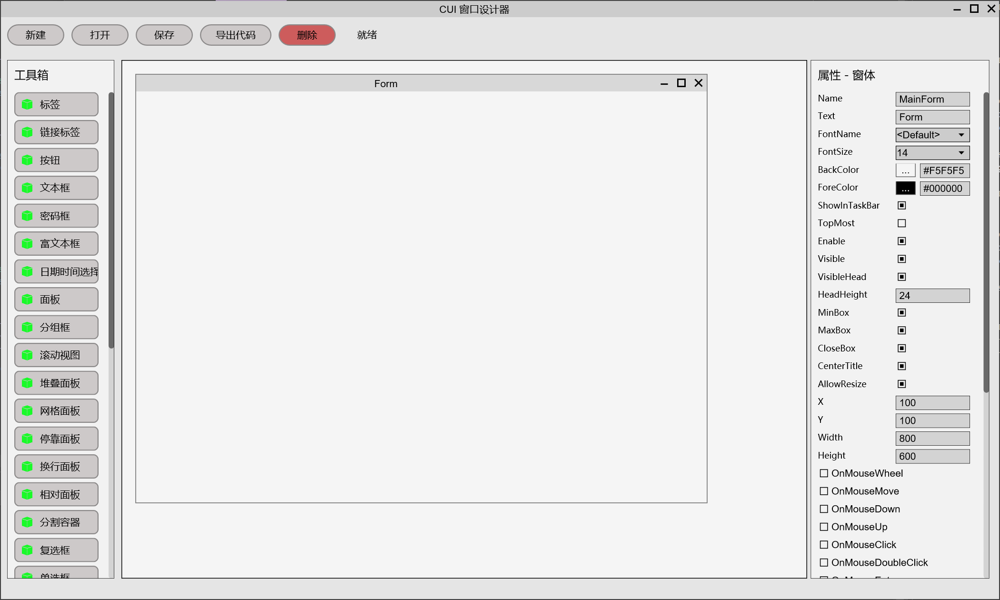

### Demo 窗口与菜单

示例程序包含主窗口菜单、独立上下文菜单，以及 TabControl 的多个演示页面。

| 主窗口菜单 | 上下文菜单 |
| --- | --- |
| 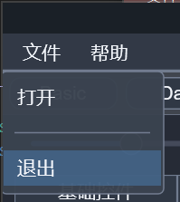 | 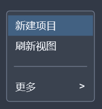 |

### TabControl 页面截图

以下截图对应 Demo 中选中 TabControl 不同页面时的显示效果：

| Tab 1 | Tab 2 |
| --- | --- |
| 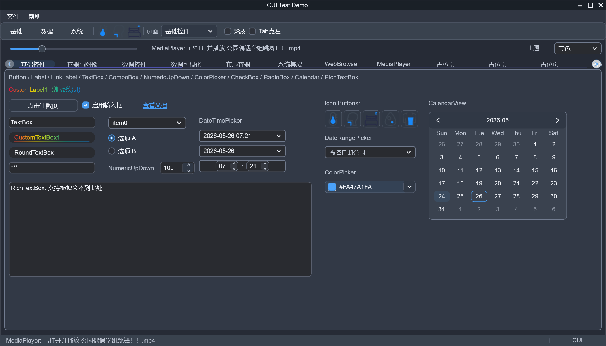 | 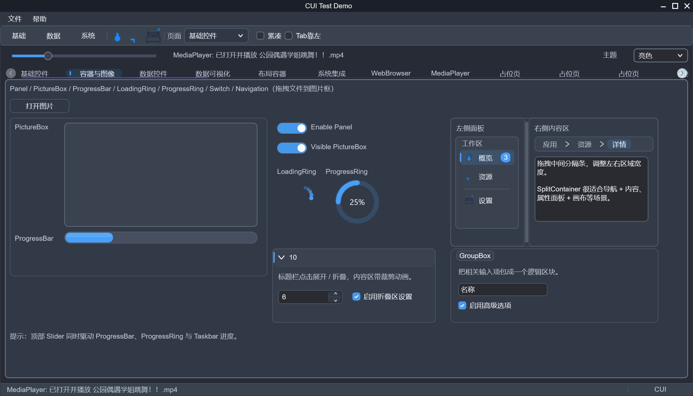 |

| Tab 3 | Tab 4 |
| --- | --- |
| 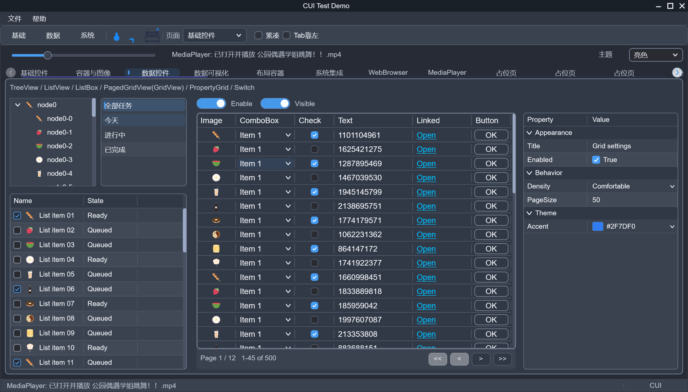 | 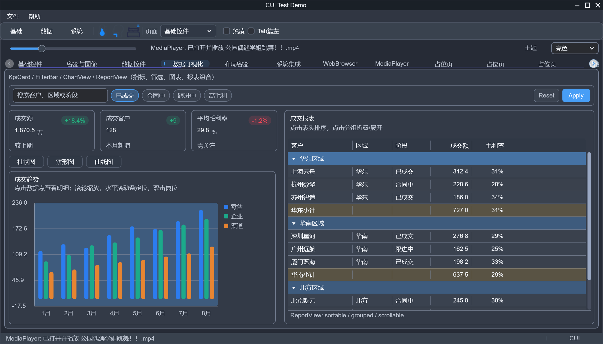 |

| Tab 5 | Tab6 |
| --- | --- |
| 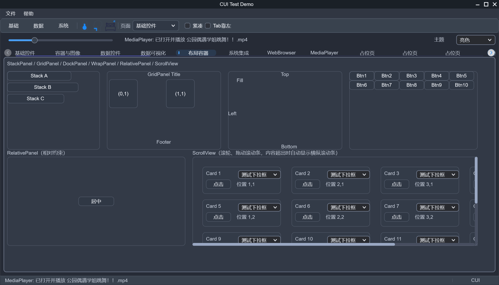 | 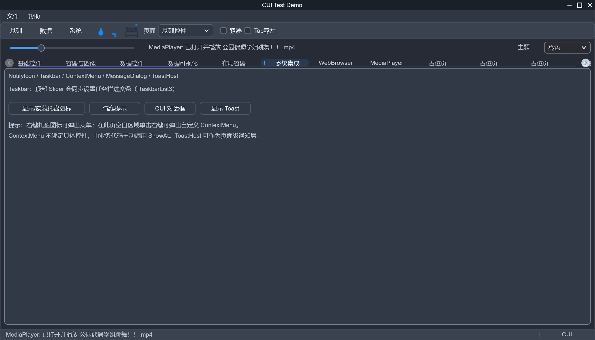 |

| WebBrowser |
| --- | --- |
| 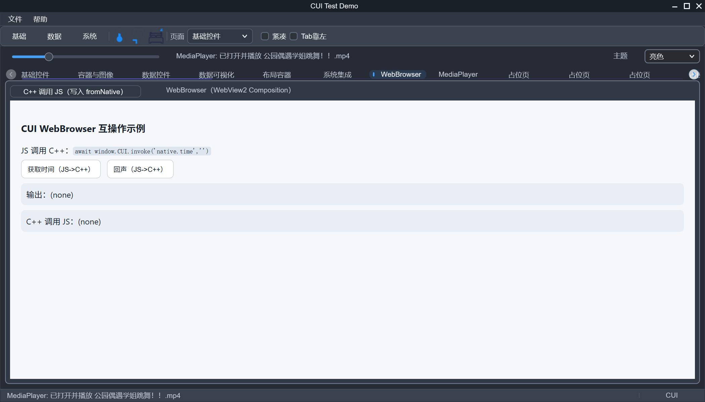 |

### 多媒体页面

MediaPlayer 页面演示了框架内置媒体播放控件。

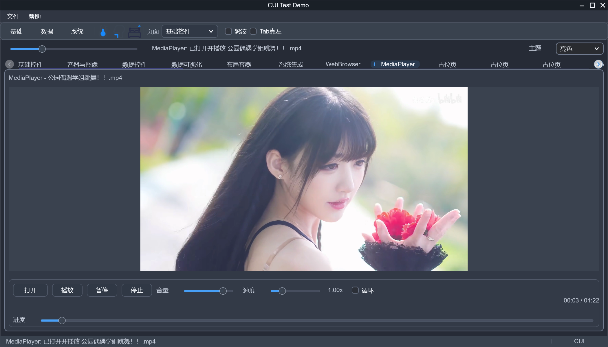

## 注意事项

- **仅支持 Windows**：依赖 Windows 图形栈（Direct2D/DirectWrite/DirectComposition）。
- **Windows版本限制**：`CUI` 支持 Windows 7+。通过预处理器宏 `CUI_ENABLE_WEBVIEW2` 控制是否启用 DirectComposition + WebView2 功能（需要 Windows 8+）；不定义该宏时仅使用 Direct2D HWND 渲染，兼容 Windows 7。
- **项目依赖关系**：
  - `CUI` 依赖 `D2DGraphics`
  - `CUITest` 已内置原先来自 `Utils` 的轻量测试辅助逻辑，不再依赖 `Utils`
  - `CuiDesigner` 当前依赖 `CUI` 和 `Utils`
- **第三方依赖**：WebView2；仓库中的图形/工具源码已直接包含，无需额外引入 `CppUtils/Graphics`
- **设计器输出**：设计器会按扩展名保存 XML 或 CUI XAML 设计文件并生成 C++ 代码；建议把 `.cui.xml` / `.cui.xaml` 作为长期 UI 源文件纳入版本控制。

## 交流社区
- **QQ群**：522222570

许可证：AFL 3.0，见 `LICENSE`。
